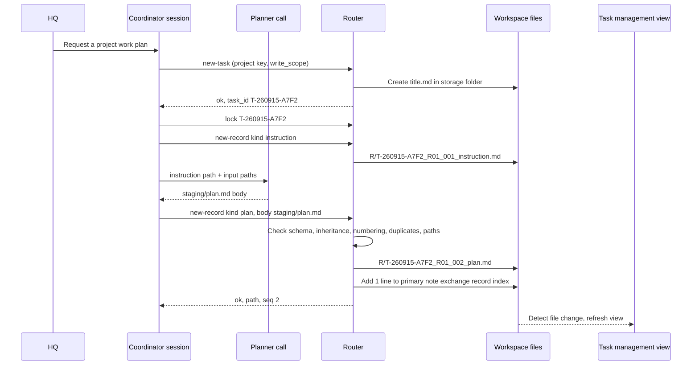

# routing

## overview

**Scope:** Extended mode specification. Basic operation follows the [setup guide](../Setup/README.md#도입-모드). Adopting this specification does not mean the Router has been implemented or tested.

Defines where AI work files are created, under what name, and after which checks. Today only the rules exist; once a Router program is implemented and tested, it applies these rules mechanically.

| Section | Content | Applies |
|---|---|---|
| [router-role](#router-role) | What the Router does and does not do, components, call flow | Extended spec |
| [placement-rules](#placement-rules) | Location of TaskNotes and [exchange records](../Architecture/Document_System_admin.md#교환-기록) | Extended spec |
| [project-resolution](#project-resolution) | Grounds for choosing the project to store in | Extended spec |
| [commands](#commands) | Router commands and exit codes | Extended spec |
| [processing-order](#processing-order) | File creation steps and frontmatter handling | Extended spec |
| [failures-and-concurrency](#failures-and-concurrency) | Handling failures, and tests | Extended spec |
| [related-documents](#related-documents) | Schema and workspace | Extended spec |

## router-role

The Router is **a command-line program that creates AI TaskNotes and exchange record files and puts them in place**. It is not an agent; it makes no judgments and only applies rules.

| The Router does | The Router does not |
|---|---|
| Create primary tasks and record files, issue names and numbers | Write plan or evaluation content, decide verdicts |
| Inherit the parent's `task_id` and storage folder | Read request text to guess the project |
| Check the [schema](Task_and_Record_Schema_agent.md#machine-readable-block) and [invariants](Task_and_Record_Schema_agent.md#invariants); refuse to save on violation | Decide which role to call next |
| Add one record link line to the parent note | Move or delete existing files (it only prints a move table) |
| Manage task lock files | Watch continuously or resume automatically |

| Component | Location | Version control | Content |
|---|---|---|---|
| Router program | [`{router}`](../Architecture/Company_Profile_admin.md#작업-공간-경로) | Tracked | One command-line program file, using only the script runtime's standard library |
| Tests | Test file in the Router's folder | Tracked | Run against a fake workspace in a temp folder |
| Schema | [Task and record schema](Task_and_Record_Schema_agent.md#machine-readable-block) | Tracked | JSON block the Router reads |
| Project key table | [Project keys](../Architecture/Company_Profile_admin.md#프로젝트-키) | Tracked | Table the Router reads |
| Runtime folder | [`{runtime-dir}`](../Architecture/Company_Profile_admin.md#작업-공간-경로) | Excluded, outside sync | `staging/<task_id>/` role output bodies, `locks/<task_id>.lock` |

A command-line program is used because any agent with a shell can call it without installation, and it works even with the editor closed. It uses only the standard library so no device needs extra installs.



## placement-rules

Today every AI TaskNote sits directly under [`{task-folder}`](../Architecture/Company_Profile_admin.md#작업-공간-경로), and the file name is both title and ID. Folders are not changed by status.

### project-folder-placement-extended

| Rule | Content |
|---|---|
| Primary task | `<task-folder>/<storage folder>/<title>.md`. Storage folders are in the [project key](../Architecture/Company_Profile_admin.md#프로젝트-키) table |
| Exchange records | `R/` in the same storage folder |
| Legacy task | Existing tasks directly under the task folder stay in place; their records go in `R/` of the storage folder found from the `projects` value |
| Multiple projects | Store in one primary project; list all related values in `projects`. Never make copies |
| Confidential paths | If read or write targets include a confidential path, check against HQ's original text and approval grounds. `--confidential-named` is only a check hint, not proof of authority. The ban on external transfer still holds |
| Path length | Absolute path of 240 characters or fewer |
| Status folders | Do not create |
| Moves | The Router does not move files. `plan-moves` only prints a move table; moves use `git mv` after [risk-level](../Architecture/Risk_and_Authority_admin.md#위험도) 2 approval |

## project-resolution

The Router never reads request text or research content; it compares only two grounds. Prefixes are compared on path-component boundaries, choosing the longest match; `P1` does not contain `P10`. Real absolute paths are normalized, and anything escaping the allowed root via `..`, symbolic links, or junctions is refused.

1. **Candidate key:** The `--project` passed by the Coordinator. Pass only keys written in HQ's original text ([intake](Roles/Coordinator_agent.md#intake)).

2. **Path keys:** Match each path in `write_scope` against the path prefixes in the project key table. The task folder's own path is excluded from the grounds.

| Case | Result |
|---|---|
| Candidate and path key match, or only a candidate key | Candidate key |
| No candidate key, one path key | That key |
| Two or more path keys | Exit code 3. With `--primary <key>`, store under primary and list all related keys in `projects` |
| Candidate and path key differ | Exit code 3, print both grounds |
| Neither | Store in `UNSORTED` and write `분류: 확인 필요 — 근거 없음` in `# 현재 상태` |

## commands

| Command | Main arguments | Files written | Caller |
|---|---|---|---|
| `new-task` | `--title`, `--project`, `--write-scope`, `--risk`, `--mode`, `--report`, `--primary`, `--confidential-named` | 1 primary task | Coordinator |
| `new-record` | `--parent`, `--kind`, `--body`, `--responds-to`, `--verdict`, `--lock-token`, `--request-id` | 1 record + 1 parent index line | Coordinator |
| `adopt` | `<task path>` | 1 `task_id` line in the target frontmatter | Coordinator |
| `lock` / `unlock` | `<task_id>`, `--paths`, `--lease-min`, `--force --reason` | Runtime lock file | Coordinator |
| `check` | `[paths…]` or `--all` | None | Anyone |
| `check-schema` | — | None | Anyone |
| `repair-links` | `--parent` | Parent index | Coordinator |
| `plan-moves` | `--all` | None (prints a table) | Coordinator |

Example (hypothetical; path values come from the company profile):

```powershell
python <router 경로> new-record `
  --parent "<task-folder>/PRJ1/PRJ1 LUT 검증 계획.md" `
  --kind evaluation `
  --responds-to T-260915-A7F2_R01_002_plan `
  --verdict revise `
  --body "<runtime-dir>/staging/T-260915-A7F2/evaluation_attempt1.md" `
  --lock-token 7c1e9a
```

```json
{"ok": true, "path": "<task-folder>/PRJ1/R/T-260915-A7F2_R01_003_evaluation.md", "run": "R01", "seq": 3, "duplicate": false, "parent_index_updated": true}
```

| Exit code | Meaning | Coordinator's next action |
|---:|---|---|
| 0 | Success (a duplicate request returns the existing path) | Call the next role |
| 1 | Usage error | Fix call arguments |
| 2 | Schema or format violation | Return the error list to the role to fix the body |
| 3 | Classification conflict, lock mismatch, confidential path | Stop and record the reason in `# 현재 상태`; HQ if needed |
| 4 | Write or parent index update failed | Check the issued path and index state in the JSON. Retry with the same request-id or run repair-links. Atomicity across both the record and parent files is not guaranteed |

## processing-order

### new-record-processing-order

| # | Step | On failure |
|---:|---|---|
| 1 | Check arguments: `--kind` is a schema record kind, `--body` file exists, UTF-8 | 1 |
| 2 | Check lock: the lock file's token equals `--lock-token` | 3 |
| 3 | Read parent: under the task folder and without `doc_kind`. If `task_id` is missing, require `adopt` first | 2 |
| 4 | Compute storage folder: the parent's folder if the parent is inside one; for legacy, convert the `projects` value via the key table. Target is `<storage folder>/R/` | 3 |
| 5 | Look up `request-id` duplicates first. Same parent, kind, reference, verdict, and body hash → return the existing result and repair the index; same ID with a different payload → refuse. Only new requests compute run and sequence: read `<task_id>_*` in `R/`. instruction → run+1, otherwise latest run. Sequence is max+1. The first record must be an instruction | 2 |
| 6 | Check reference: `--responds-to` is an existing record of the same task and an allowed kind (invariant I3) | 2 |
| 7 | Schema check: required fields, allowed values, required `##` headings and order | 2 |
| 8 | Invariant check: I4 verdict and findings table, I5 pass evaluation before execution, I7 contract version and run | 2 |
| 9 | Reserve request-id and payload digest in the runtime journal. Never merge distinct runs, including run and verdict, because content matches. Keep the ID in the record body metadata too so the journal can be recovered | 3 on conflict |
| 10 | Path length: absolute path of 240 characters or fewer | 2 |
| 11 | Atomic write: write and flush to `.tmp` in the same folder → recheck → publish `.md` without overwriting an existing name. Recheck lock token, generation, and lease just before publishing | 4; leftover tmp is reported then kept in trash |
| 12 | Parent index: recompare the parent body hash and add the record link. If full locking against other editors cannot be guaranteed, stop automatic parent writes and suggest repair-links | 4; issued record kept |
| 13 | Print result JSON | — |

### new-task-processing-order

| # | Step | On failure |
|---:|---|---|
| 1 | Check arguments: no forbidden prefix in the title ([naming rules](../Architecture/Company_Profile_admin.md#명명-규칙)) | 1 |
| 2 | [Project resolution](#project-resolution) | 3 |
| 3 | Confidential path check | 3 |
| 4 | Issue `task_id`: date + 4 random hex digits. Reissue on collision anywhere in the task folder (up to 5 times) | 4 |
| 5 | Compute file path: refuse if the name exists or exceeds 240 characters | 2 |
| 6 | Fill the template and write atomically | 4 |
| 7 | Print result JSON: path, `task_id`, resolution grounds | — |

### frontmatter-reading-and-writing

Because it uses only the standard library, the Router **reads a limited format only**.

| Format | Handling |
|---|---|
| `key: value`, `key: "value"`, `key:` (empty), `key: []` | Read |
| A `  - item` list on lines after `key:` | Read |
| Any other format (nested objects, multi-line strings) | If the Router does not write that key, preserve the original lines and ignore them. If a required key uses such a format, exit code 2 |

Writes never reserialize the whole file. New files use a fixed key order; existing files get only a one-line `task_id` insertion or an index line appended to the body. This avoids changing frontmatter formatting written by people or task management tools.

## failures-and-concurrency

| Situation | Router behavior |
|---|---|
| Another session holds the lock | Exit code 3, no writes |
| Lock past its lease | Never taken automatically. The Coordinator checks the process, then runs `unlock --force --reason` ([locks and budget](Roles/Coordinator_agent.md#locks-and-budget)) |
| `.tmp` left from an earlier failure | `check` reports it. Clean up by moving to trash |
| Record exists but the parent index line is missing | `repair-links` reads file names and fills the gap. Rerunning adds no duplicate lines |
| A person is editing the parent note | Compare body hashes rather than trusting modification times alone. Automatic parent writes during execution are used only in a single-writer session with editing paused. On detecting an external edit, keep the record and stop the index update |
| Conflicted copies from the sync tool | `check` finds and reports them. No automatic merge |

### tests

All tests run against a fake workspace in a temp folder.

| Test | Expected result |
|---|---|
| Parent inheritance and path | Saved in `R/` of the parent's storage folder; file name prefix = parent `task_id` |
| Run increment | Issuing an instruction → `R02`; later records are `R02` |
| First-record rule | Issuing a plan without an instruction → exit code 2 |
| Duplicate request | Resending the same request-id → 1 file. Instruction retry increments run by 0. Reusing an ID with a different verdict or body is refused |
| Invalid reference | evaluation with `responds_to` an instruction → exit code 2 |
| Lock mismatch | Exit code 3, 0 file changes |
| Simulated write interruption | Interrupted just before rename → no `.md`, 0 parent changes |
| Index repair | Delete an index line, then `repair-links` → 1 line added; rerun adds 0 |
| Complex frontmatter | `adopt` on a note with nested objects → only 1 `task_id` line added, all other bytes identical |
| Path length | 241 characters → exit code 2 |
| Project resolution | Each of the five cases in the [project resolution](#project-resolution) table gives its expected result |
| Schema mismatch | `check-schema` fails if the table and JSON block differ in kinds, allowed values, or required sections |
| Path escape and lock renewal | Junction and parent-path escapes refused; publication by an expired writer refused |
| Next run with identical content | New request-id and new run are separate records. Verdicts from an earlier run are not reused |

## related-documents

- [Task and record schema](Task_and_Record_Schema_agent.md) — rules the Router checks
- [Workspace and tools](../Architecture/Workspace_and_Tools_admin.md#런타임과-router) — the runtime layer the Router belongs to
- [Coordinator](Roles/Coordinator_agent.md) — the role that calls the Router
- [Company profile](../Architecture/Company_Profile_admin.md#프로젝트-키) — project key table
