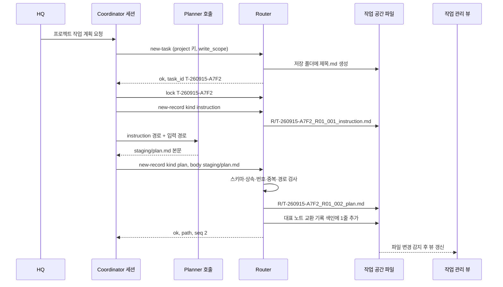

# 라우팅

## overview

**적용 범위:** 확장 모드 사양입니다. 기본 운영은 [설치 안내](../Setup/README.md#도입-모드)를 따릅니다. 사양 채택은 Router 구현·시험 완료를 뜻하지 않습니다.

AI 작업 파일을 어디에, 어떤 이름으로, 어떤 검사를 거쳐 만드는지 정합니다. 현재는 규칙만 있고, Router 프로그램이 구현·시험되면 그 규칙을 기계로 적용합니다.

| 섹션 | 내용 | 적용 |
|---|---|---|
| [router의-역할](#router의-역할) | Router가 하는 일과 하지 않는 일, 구성, 호출 흐름 | 확장 사양 |
| [배치-규칙](#배치-규칙) | TaskNote와 [교환 기록](../Architecture/Document_System_admin.md#교환-기록)의 위치 | 확장 사양 |
| [프로젝트-판정](#프로젝트-판정) | 저장할 프로젝트를 정하는 근거 | 확장 사양 |
| [명령](#명령) | Router 명령과 종료 코드 | 확장 사양 |
| [처리-순서](#처리-순서) | 파일 생성의 단계와 frontmatter 처리 | 확장 사양 |
| [실패와-동시성](#실패와-동시성) | 실패 상황의 처리와 시험 | 확장 사양 |
| [관련-문서](#관련-문서) | 스키마와 작업 공간 | 확장 사양 |

## router의-역할

Router는 **AI TaskNote와 교환 기록 파일을 만들고 제자리에 두는 명령줄 프로그램**입니다. Agent가 아니며, 판단하지 않고 규칙만 적용합니다.

| Router가 하는 일 | Router가 하지 않는 일 |
|---|---|
| 대표 task와 기록 파일 생성, 이름·번호 발급 | 계획·평가 내용 작성, 판정 결정 |
| 부모의 `task_id`·저장 폴더 상속 | 요청 문장을 읽고 프로젝트 추정 |
| [스키마](Task_and_Record_Schema_agent.md#기계-판독-블록)와 [불변식](Task_and_Record_Schema_agent.md#불변식) 검사, 위반 시 저장 거부 | 다음에 어떤 역할을 부를지 결정 |
| 부모 노트에 기록 링크 한 줄 추가 | 기존 파일 이동·삭제 (이동표만 출력) |
| 작업 잠금 파일 관리 | 상시 감시, 자동 재개 |

| 구성 | 위치 | 버전 관리 | 내용 |
|---|---|---|---|
| Router 프로그램 | [`{router}`](../Architecture/Company_Profile_admin.md#작업-공간-경로) | 추적 | 명령줄 프로그램 한 파일. 스크립트 런타임의 표준 라이브러리만 사용 |
| 시험 | Router와 같은 폴더의 시험 파일 | 추적 | 임시 폴더의 가짜 작업 공간에서 시험 |
| 스키마 | [작업과 기록 스키마](Task_and_Record_Schema_agent.md#기계-판독-블록) | 추적 | Router가 읽는 json 블록 |
| 프로젝트 키 표 | [프로젝트 키](../Architecture/Company_Profile_admin.md#프로젝트-키) | 추적 | Router가 읽는 표 |
| 런타임 폴더 | [`{runtime-dir}`](../Architecture/Company_Profile_admin.md#작업-공간-경로) | 제외, 동기화 밖 | `staging/<task_id>/` 역할 산출물 본문, `locks/<task_id>.lock` |

설치 없이 셸을 쓰는 어떤 Agent든 부를 수 있고, 편집기가 닫혀 있어도 동작하기 때문에 명령줄 프로그램을 씁니다. 표준 라이브러리만 쓰는 이유는 기기마다 추가 설치를 요구하지 않기 위해서입니다.



## 배치-규칙

현재 모든 AI TaskNote는 [`{task-folder}`](../Architecture/Company_Profile_admin.md#작업-공간-경로) 바로 아래에 두고, 파일 이름이 제목이자 ID입니다. 상태에 따라 폴더를 옮기지 않습니다.

### 프로젝트-폴더-배치-확장

| 규칙 | 내용 |
|---|---|
| 대표 task | `<task-folder>/<저장 폴더>/<제목>.md`. 저장 폴더는 [프로젝트 키](../Architecture/Company_Profile_admin.md#프로젝트-키) 표에 있음 |
| 교환 기록 | 같은 저장 폴더의 `R/` |
| legacy task | 작업 폴더 바로 아래의 기존 task는 제자리에 두고, 기록은 `projects` 값으로 찾은 저장 폴더의 `R/`에 둠 |
| 다중 프로젝트 | 저장은 주 프로젝트 한 곳, `projects`에는 관련 값 여러 개. 사본을 만들지 않음 |
| 기밀 경로 | 읽기·쓰기 대상에 기밀 경로가 있으면 HQ 원문과 승인 근거를 대조. `--confidential-named`는 검사 힌트일 뿐 권한 증명이 아님. 외부 전달 금지는 유지 |
| 경로 길이 | 절대 경로 240자 이하 |
| 상태 폴더 | 만들지 않음 |
| 이동 | Router는 옮기지 않음. `plan-moves`가 이동표만 출력하고 이동은 [위험도](../Architecture/Risk_and_Authority_admin.md#위험도) 2 승인 후 `git mv` |

## 프로젝트-판정

Router는 요청 문장이나 연구 내용을 읽지 않고, 두 가지 근거만 비교합니다. prefix는 경로 구성요소 경계로 비교하며 가장 긴 일치 경로를 택합니다. `P1`이 `P10`을 포함한다고 보지 않습니다. 실제 절대 경로를 정규화하고 `..`·심볼릭 링크·junction으로 허용 루트 밖에 나가면 거부합니다.

1. **후보 키:** Coordinator가 넘긴 `--project`. HQ 원문에 적힌 키만 넘깁니다 ([접수](Roles/Coordinator_agent.md#접수)).

2. **경로 키:** `write_scope`의 각 경로를 프로젝트 키 표의 경로 prefix와 대조합니다. 작업 폴더 자신의 경로는 근거에서 뺍니다.

| 경우 | 결과 |
|---|---|
| 후보 키와 경로 키가 같음, 또는 후보 키만 있음 | 후보 키 |
| 후보 키 없음, 경로 키 1개 | 그 키 |
| 경로 키 2개 이상 | 종료 코드 3. `--primary <키>`가 있으면 저장은 primary, `projects`에는 관련 키 값 모두 |
| 후보 키와 경로 키가 다름 | 종료 코드 3, 두 근거를 출력 |
| 둘 다 없음 | `UNSORTED`에 저장하고 `# 현재 상태`에 `분류: 확인 필요 — 근거 없음` |

## 명령

| 명령 | 주요 인자 | 쓰는 파일 | 호출 주체 |
|---|---|---|---|
| `new-task` | `--title`, `--project`, `--write-scope`, `--risk`, `--mode`, `--report`, `--primary`, `--confidential-named` | 대표 task 1개 | Coordinator |
| `new-record` | `--parent`, `--kind`, `--body`, `--responds-to`, `--verdict`, `--lock-token`, `--request-id` | 기록 1개 + 부모 색인 1줄 | Coordinator |
| `adopt` | `<task 경로>` | 대상 frontmatter에 `task_id` 1줄 | Coordinator |
| `lock` / `unlock` | `<task_id>`, `--paths`, `--lease-min`, `--force --reason` | 런타임 잠금 파일 | Coordinator |
| `check` | `[경로…]` 또는 `--all` | 없음 | 누구나 |
| `check-schema` | — | 없음 | 누구나 |
| `repair-links` | `--parent` | 부모 색인 | Coordinator |
| `plan-moves` | `--all` | 없음 (표 출력) | Coordinator |

실행 예 (가상, 경로 값은 회사 프로필에서):

```powershell
python <router 경로> new-record `
  --parent "<task-folder>/PRJ1/PRJ1 LUT 검증 계획.md" `
  --kind evaluation `
  --responds-to T-260915-A7F2_R01_002_plan `
  --verdict revise `
  --body "<runtime-dir>/staging/T-260915-A7F2/evaluation_attempt1.md" `
  --lock-token 7c1e9a
```

```json
{"ok": true, "path": "<task-folder>/PRJ1/R/T-260915-A7F2_R01_003_evaluation.md", "run": "R01", "seq": 3, "duplicate": false, "parent_index_updated": true}
```

| 종료 코드 | 뜻 | Coordinator의 다음 행동 |
|---:|---|---|
| 0 | 성공 (중복 요청이면 기존 경로 반환) | 다음 역할 호출 |
| 1 | 사용법 오류 | 호출 인자 수정 |
| 2 | 스키마·형식 위반 | 오류 목록을 해당 역할에 돌려 본문 수정 |
| 3 | 분류 충돌, 잠금 불일치, 기밀 경로 | 멈추고 `# 현재 상태`에 사유 기록, 필요하면 HQ |
| 4 | 쓰기 또는 부모 색인 갱신 실패 | JSON의 발행 경로·색인 상태를 확인. 같은 request-id로 재시도하거나 repair-links. 기록과 부모의 두 파일 전체가 원자적이라고 보장하지 않음 |

## 처리-순서

### new-record-처리-순서

| # | 단계 | 실패하면 |
|---:|---|---|
| 1 | 인자 확인: `--kind`가 스키마의 기록 종류, `--body` 파일 존재, UTF-8 | 1 |
| 2 | 잠금 확인: 잠금 파일의 token이 `--lock-token`과 같음 | 3 |
| 3 | 부모 읽기: 작업 폴더 아래에 있고 `doc_kind` 없음. `task_id`가 없으면 `adopt` 먼저 요구 | 2 |
| 4 | 저장 폴더 계산: 부모가 저장 폴더 안이면 그 폴더, legacy면 `projects` 값을 키 표로 변환. 대상은 `<저장 폴더>/R/` | 3 |
| 5 | `request-id` 중복을 먼저 조회. 같은 부모·종류·참조·verdict·본문 hash면 기존 결과를 반환하고 색인을 복구, 같은 ID의 다른 payload면 거부. 새 요청만 run·순번 계산: `R/`에서 `<task_id>_*`를 읽음. instruction이면 run+1, 아니면 최신 run. 순번은 최대+1. 첫 기록은 반드시 instruction | 2 |
| 6 | 참조 확인: `--responds-to`가 같은 task의 기존 기록이고 허용 종류 (불변식 I3) | 2 |
| 7 | 스키마 검사: 필수 필드, 허용 값, 필수 `##` 제목과 순서 | 2 |
| 8 | 불변식 검사: I4 판정과 발견 표, I5 실행 전 pass 평가, I7 계약 버전과 run | 2 |
| 9 | request-id와 payload digest를 런타임 journal에 예약. run·verdict를 포함해 서로 다른 실행을 내용이 같다는 이유로 합치지 않음. 기록 본문 메타데이터에도 ID를 보존해 journal 복구 가능 | 충돌이면 3 |
| 10 | 경로 길이: 절대 경로 240자 이하 | 2 |
| 11 | 원자적 쓰기: 같은 폴더 `.tmp`에 쓰고 flush → 재검사 → 기존 이름 덮어쓰기 없이 `.md` 발행. 발행 직전 잠금 token·세대·lease 재검사 | 4, 잔여 tmp는 보고 후 휴지통 보존 |
| 12 | 부모 색인: 부모 본문 hash를 다시 비교하고 기록 링크를 추가. 다른 편집기와의 완전한 잠금을 보장하지 못하면 부모 자동 쓰기를 중지하고 repair-links 후보를 제시 | 4, 발행 기록 보존 |
| 13 | 결과 JSON 출력 | — |

### new-task-처리-순서

| # | 단계 | 실패하면 |
|---:|---|---|
| 1 | 인자 확인: 제목에 금지 접두사 없음 ([명명 규칙](../Architecture/Company_Profile_admin.md#명명-규칙)) | 1 |
| 2 | [프로젝트 판정](#프로젝트-판정) | 3 |
| 3 | 기밀 경로 검사 | 3 |
| 4 | `task_id` 발급: 날짜 + 무작위 16진 4자리. 작업 폴더 전체와 충돌하면 재발급 (최대 5회) | 4 |
| 5 | 파일 경로 계산: 같은 이름이 있거나 240자를 넘으면 거부 | 2 |
| 6 | 템플릿을 채워 원자적 쓰기 | 4 |
| 7 | 결과 JSON 출력: 경로, `task_id`, 판정 근거 | — |

### frontmatter-읽기와-쓰기

표준 라이브러리만 쓰므로 Router는 **제한된 형식만 읽습니다.**

| 형식 | 처리 |
|---|---|
| `key: 값`, `key: "값"`, `key:` (빈 값), `key: []` | 읽음 |
| `key:` 다음 줄의 `  - 항목` 목록 | 읽음 |
| 그 밖의 형식 (중첩 객체, 여러 줄 문자열) | Router가 쓰지 않는 키면 원문 줄을 그대로 보존하고 무시. 필수 키가 이 형식이면 종료 코드 2 |

쓰기는 파일 전체를 다시 직렬화하지 않습니다. 새 파일은 고정된 키 순서로 만들고, 기존 파일은 `task_id` 한 줄 삽입이나 본문 끝의 색인 줄 추가만 합니다. 사람이나 작업 관리 도구가 쓴 frontmatter 형식을 바꾸지 않기 위해서입니다.

## 실패와-동시성

| 상황 | Router 동작 |
|---|---|
| 다른 세션이 잠금을 가짐 | 종료 코드 3, 쓰기 없음 |
| lease가 지난 잠금 | 자동으로 빼앗지 않음. Coordinator가 프로세스를 확인한 뒤 `unlock --force --reason` ([잠금과 예산](Roles/Coordinator_agent.md#잠금과-예산)) |
| 이전 실패로 `.tmp`가 남음 | `check`가 보고. 치울 때는 휴지통으로 이동 |
| 기록은 생겼는데 부모 색인 줄이 없음 | `repair-links`가 파일명을 읽어 보충. 다시 실행해도 중복 줄 없음 |
| 사람이 부모 노트를 편집하는 중 | 수정 시각만 신뢰하지 않고 본문 hash를 비교. 실행 중 부모 자동 쓰기는 편집을 멈춘 단일 작성자 세션에서만 사용. 외부 편집 발견 시 기록은 보존하고 색인 갱신 중단 |
| 동기화 도구의 충돌 사본 | `check`가 찾아 보고. 자동 병합하지 않음 |

### 시험

모든 시험은 임시 폴더의 가짜 작업 공간에서 합니다.

| 시험 | 기대 결과 |
|---|---|
| 부모 상속·경로 | 부모 저장 폴더의 `R/`에 저장, 파일명 접두사 = 부모 `task_id` |
| run 증가 | instruction 발행 → `R02`, 이후 기록은 `R02` |
| 첫 기록 규칙 | instruction 없이 plan 발행 → 종료 코드 2 |
| 중복 요청 | 같은 request-id 재전송 → 파일 1개. instruction 재시도에서 run 증가 0. ID 재사용에 다른 verdict·본문이면 거부 |
| 잘못된 참조 | evaluation이 instruction을 `responds_to` → 종료 코드 2 |
| 잠금 불일치 | 종료 코드 3, 파일 변화 0 |
| 쓰기 중단 모의 | 이름 변경 직전 중단 → `.md` 없음, 부모 변화 0 |
| 색인 복구 | 색인 줄 삭제 후 `repair-links` → 1줄 추가, 재실행 시 추가 0 |
| 복잡한 frontmatter | 중첩 객체가 있는 노트의 `adopt` → `task_id` 1줄만 추가, 나머지 바이트 동일 |
| 경로 길이 | 241자 → 종료 코드 2 |
| 프로젝트 판정 | [프로젝트 판정](#프로젝트-판정) 표의 다섯 경우가 각각 기대 결과 |
| 스키마 불일치 | 표와 json 블록의 종류·허용 값·필수 구획이 다르면 `check-schema` 실패 |
| 경로 탈출·잠금 갱신 | junction·상위 경로 탈출 거부, 만료된 작성자의 발행 거부 |
| 같은 내용의 다음 run | 새 request-id·새 run은 별도 기록. 이전 run의 판정을 재사용하지 않음 |

## 관련-문서

- [작업과 기록 스키마](Task_and_Record_Schema_agent.md) — Router가 검사하는 규칙
- [작업 공간과 도구](../Architecture/Workspace_and_Tools_admin.md#런타임과-router) — Router가 속한 런타임 계층
- [Coordinator](Roles/Coordinator_agent.md) — Router를 호출하는 역할
- [회사 프로필](../Architecture/Company_Profile_admin.md#프로젝트-키) — 프로젝트 키 표
