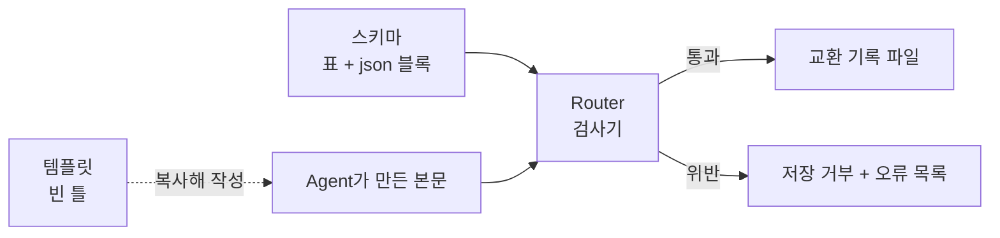

# 작업과-기록-스키마

## overview

AI 작업 문서가 가져야 할 종류, frontmatter 필드, 본문 구획, 문서 사이 규칙을 정의합니다. 문서가 어디에 쓰이는지는 [문서 체계](../Architecture/Document_System.md#작업-문서)에 있습니다.

| 섹션 | 내용 | 상태 | 근거 |
|---|---|---|---|
| [스키마란](#스키마란) | 스키마의 뜻, 템플릿·검사기와의 차이 | proposed | 제안서 02 |
| [문서-종류](#문서-종류) | 대표 task와 교환 기록 종류 | adopted, proposed | DEC-HQ-005, 제안서 02 |
| [대표-task-필드](#대표-task-필드) | TaskNote frontmatter | adopted, proposed | 기존 AI_Protocol §4, 제안서 02 Q3 |
| [교환-기록-필드](#교환-기록-필드) | 교환 기록 frontmatter | proposed | 제안서 02 Q1 |
| [id와-파일명](#id와-파일명) | 작업 ID, 기록 파일명, 번호 | adopted, proposed | Conventions Naming, 제안서 02 |
| [버전](#버전) | 버전 필드와 run의 관계 | adopted, proposed | DEC-HQ-005, 제안서 02 |
| [불변식](#불변식) | 문서 사이에 항상 성립할 규칙 | proposed | 제안서 02 |
| [기계-판독-블록](#기계-판독-블록) | Router가 읽는 json 규칙 | proposed | 제안서 02 Q4 |
| [스키마-변경](#스키마-변경) | 스키마를 바꾸는 법, 문서별 버전 필드를 두지 않는 이유 | proposed | 제안서 02 Q2 |
| [관련-문서](#관련-문서) | Router와 기록 형식 | — | — |

## 스키마란

> [!NOTE]
> 제안 — 제안서 02 결정 대기.

**스키마는 "이 종류의 문서는 어떤 칸을 반드시 갖고, 각 칸에 어떤 값만 들어갈 수 있는가"를 적은 약속입니다.** 측정 데이터로 비유하면 CSV의 열 이름·단위·허용 범위를 정한 정의서입니다. 데이터 파일이 수백 개여도 정의서는 하나이고, 검사기는 정의서를 기준으로 파일을 통과시키거나 거부합니다.

| 층 | 정하는 것 | 예 | 이 층이 없으면 |
|---|---|---|---|
| 문서 종류 | 어떤 기록이 있는가 | `plan`, `evaluation`, `execution` | Agent마다 다른 이름으로 기록해 뷰에서 빠짐 |
| 필드 | 종류별 frontmatter 칸과 허용 값 | evaluation의 `verdict`는 `pass`·`revise`·`hq-required` 중 하나 | `verdict: 통과`를 기계가 읽지 못함 |
| 본문 구획 | 종류별 필수 `##` 제목 | evaluation은 입력·[필수 조건](Roles/Evaluator.md#필수-조건)·점수·발견·판정 근거 | 근거 없이 판정만 남음 |
| 불변식 | 문서 사이의 규칙 | 실행한 plan에는 pass 평가가 있어야 함 | 평가받지 않은 계획이 실행됨 |

| 용어 | 뜻 | 파일 |
|---|---|---|
| 스키마 | 규칙: 무엇이 올바른 문서인가 | 이 문서 |
| 템플릿 | 규칙을 만족하는 빈 틀 | [`{templates}`](../Architecture/Company_Profile.md#작업-공간-경로)의 작업·교환 기록 템플릿 |
| 검사기 | 규칙대로 문서를 검사하는 프로그램 | [Router](Routing.md#router의-역할)의 `check`와 `new-record` |



검사에 걸리면 다음과 같은 출력이 나옵니다 (가상 예시).

```text
router new-record ... → 종료 코드 2
T-260915-A7F2 evaluation 저장 거부
  E-REQ   verdict 없음 (evaluation 필수 필드)
  E-ENUM  verdict: 통과 → 허용 값 pass, revise, hq-required
  E-REF   responds_to가 plan이 아님: T-260915-A7F2_R01_001_instruction
```

## 문서-종류

현재 AI 작업 문서는 대표 task 한 종류, 곧 [TaskNote](../Architecture/Document_System.md#작업-문서)입니다.

### 교환-기록-종류-제안

> [!NOTE]
> 제안 — 제안서 02 결정 대기.

| 종류 | 작성 역할 | 용도 | 필수 `##` 구획 | `responds_to` |
|---|---|---|---|---|
| `instruction` | Coordinator | 이번 run의 계약과 입력 고정 | HQ 원문 · 계약 · 승인 snapshot · 입력 | 없음 |
| `plan` | Planner | 실행 계획 | 가정 · 대안 · 작업 단계 · 완료 기준 대응 · 예산 · 중단·복구. 수정본은 맨 앞에 지적 반영 | 최초는 없음, 수정본은 `evaluation` |
| `evaluation` | Evaluator | 계획 평가 | 입력 · 필수 조건 · 점수 · 발견 · 판정 근거 | `plan` |
| `decision-request` | Coordinator | HQ에게 보인 결정 요청의 snapshot | 결정할 것 · 선택지 · AI 권장 · 응답 없을 때 · 재개 지점 | 없음, `evaluation`, `execution`, `verification` |
| `decision-response` | Coordinator | HQ 응답 원문과 승인 범위 | HQ 원문 · 채택 · 승인 범위 · 실행 지시 | `decision-request` |
| `execution` | Executor | 실행 명령·환경·결과 | 실행 단계 · 명령·환경 · 변경 경로 · 결과·오류 · receipt | `plan` |
| `verification` | Evaluator | 결과와 완료 기준 대조 | 완료 기준 대조 · 재현 검사 · 잔여 불확실성 · 판정 근거 | `execution` |
| `report` | Coordinator | 결과·변경 파일·인계 | 결과 · 변경 파일 · 검증 · 미해결 · 다음 인계 | 없음, `verification`, `decision-response` |

기존 대표 task는 `doc_kind` 필드가 없으며, 없으면 대표 task로 해석합니다. 작업 폴더 바로 아래의 기존 task는 legacy로 인정합니다.

## 대표-task-필드

| 필드 | 값 | 뜻 |
|---|---|---|
| `title` | 파일 이름과 같은 제목 | 작업 이름이자 ID |
| `tags` | `task`, `ai` | 작업 관리 도구가 AI 작업을 찾고 묶음 |
| `status` | `to-do`, `in-progress`, `done` | 작업 관리 상태 |
| `owner` | `ai`, [`{hq-owner}`](../Architecture/Company_Profile.md#사람과-역할-배정), `none` | 다음 행동 주체. `none`은 종료 |
| `hq` | `none`, `decide`, `dispatch`, `review` | HQ가 지금 할 일 |
| `risk` | `0`, `1`, `2` | [위험도](../Architecture/Risk_and_Authority.md#위험도) |
| `proposal_version`, `approved_version` | 제안은 `V<major>.<minor>.<patch>`, 미승인 값은 `approved_version: ""` | 제안·승인 버전 ([버전](#버전)) |
| `execution_mode` | `autonomous`, `after-approval`, `manual` | [실행 모드](../Architecture/Risk_and_Authority.md#실행-모드) |
| `report_policy` | `decision-only`, `milestone`, `final` | [보고 정책](../HQ/Control_Settings.md#보고-정책) |
| `blocked_by` | task 링크 또는 외부 조건 | 실행을 막는 의존성 (선택) |
| `projects` | [프로젝트 키](../Architecture/Company_Profile.md#프로젝트-키)의 값 | 묶음 |
| `write_scope` | 경로 목록 | [쓰기 범위](../HQ/Control_Settings.md#쓰기-범위) |
| `priority`, `due` | 작업 관리 도구의 값 | 선택 |

`status`·`owner`·`hq`는 [작업 상태](../Architecture/Command_and_Report_Flow.md#작업-상태)의 여섯 조합만 허용합니다.

### 대표-task-필드-변경-제안

> [!NOTE]
> 제안 — 제안서 02 Q3 결정 대기.

| 후보 | 판정 | 이유 |
|---|---|---|
| `task_id` | **추가** | 긴 제목 대신 기록 파일명 접두사로 씀. 제목이 바뀌어도 기록 이름 유지 |
| `blocked_by` | 이름을 `blockedBy`로 | 새 필드가 아니라 작업 관리 도구의 필드 이름에 맞춤 |
| `doc_kind` | 추가 안 함 | 필드가 없으면 대표 task |
| `schema_version` | 개별 기록 필드 대신 run의 instruction 본문에 고정 | [스키마 변경](#스키마-변경) |
| `project_key` | 추가 안 함 | 저장 폴더가 곧 프로젝트 키 |
| `task_type` | 보류 | 쓰는 뷰가 생기면 선택 필드로 추가 |
| `workflow_state`, `wait_reason`, `resume_from` | 추가 안 함 | `# 현재 상태`의 단계 줄과 checkpoint에 둠 |

## 교환-기록-필드

> [!NOTE]
> 제안 — 제안서 02 Q1 결정 대기.

frontmatter에는 기계가 분기·검사·필터에 쓰는 값만 두고, 다른 곳에서 알 수 있는 값은 두지 않습니다.

| 필드 | 적용 종류 | 값 |
|---|---|---|
| `doc_kind` | 전체 | [교환 기록 종류](#교환-기록-종류-제안)의 8종 |
| `parent_task` | 전체 | 대표 task의 전체 경로 링크 |
| `responds_to` | 표에서 허용한 종류 | 같은 task 기록의 전체 경로 링크 |
| `verdict` | `evaluation`, `verification` | evaluation: `pass`, `revise`, `hq-required` · verification: `pass`, `fail`, `inconclusive` |

기록에는 `title`, `tags`, `status`, `owner`, `hq`를 두지 않으며, 작업 관리 도구의 작업으로 색인하지 않습니다. 입력 hash, 점수, 발견, 실행 명령은 본문에 둡니다.

```yaml
# 파일: <task-folder>/PRJ1/R/T-260915-A7F2_R01_003_evaluation.md (가상 예시)
doc_kind: evaluation
parent_task: "<대표 task 전체 경로 링크>"
responds_to: "<T-260915-A7F2_R01_002_plan 전체 경로 링크>"
verdict: revise
```

## id와-파일명

대표 task는 파일 이름이 제목이자 ID입니다 ([명명 규칙](../Architecture/Company_Profile.md#명명-규칙)).

### 기록-id-제안

> [!NOTE]
> 제안 — 제안서 02 결정 대기.

| 대상 | 규칙 | 예 |
|---|---|---|
| `task_id` | `T-` + 생성일 `YYMMDD` + `-` + 16진 대문자 4자리. Router가 충돌 검사 | `T-260915-A7F2` |
| 기록 파일명 | `<task_id>_R<run 2자리>_<순번 3자리>_<doc_kind>.md`. 파일명이 기록 ID | `T-260915-A7F2_R01_003_evaluation.md` |
| run | 중복 재전송을 제외한 새 `instruction` 발행 때 1 증가 | `R01` → `R02` |
| 순번 | task 전체에서 1부터 증가. run이 바뀌어도 이어지고 재사용하지 않음 | `001`, `002` |
| 발견 ID | task 안에서 유지. 같은 결함이 다시 나오면 같은 ID | `F02` |

## 버전

대표 task의 `proposal_version`과 `approved_version`은 `V<major>.<minor>.<patch>` 형식입니다. 버전을 올리는 기준은 [버전 규칙](../HQ/Commands_and_Approval.md#버전-규칙)에만 정의합니다.

### run과-버전-제안

> [!NOTE]
> 제안 — 제안서 02 결정 대기.

| 변경 | 계약 버전 | run |
|---|---|---|
| 의미가 바뀌지 않는 문구 정정 | patch | 유지 |
| 범위·기준·권한·예산 변경 | minor | 새 instruction → 새 run |
| 목표 변경 | major | 새 instruction → 새 run |
| plan 수정, 재평가, 재실행 | 변경 없음 | 유지 (순번만 증가) |

## 불변식

> [!NOTE]
> 제안 — 제안서 02 결정 대기.

| ID | 규칙 | 검사 |
|---|---|---|
| I1 | 부모 task가 존재하고 기록은 그 task의 프로젝트 저장 폴더 `R/` 안에 있음. legacy 부모는 projects로 저장 폴더를 계산 | Router |
| I2 | 기록 파일명의 `task_id`는 부모의 `task_id`와 같음 | Router |
| I3 | `responds_to`는 같은 task의 기존 기록이며 허용 종류임. evaluation·execution·verification은 같은 run 안에서 참조 | Router |
| I4 | `verdict: pass`인 evaluation의 `## 발견` 표에는 blocking 행이 없음 | Router |
| I5 | 확장 모드의 execution이 가리키는 plan에는 같은 run의 pass evaluation이 있고 plan·계약·입력 hash가 일치. 경량은 교환 기록 자체를 생성하지 않음 | Router |
| I6 | 발행한 기록은 고치지 않음. 정정은 새 기록으로 하고 본문 첫 줄에 정정 대상을 적음 | 버전 관리 diff |
| I7 | 계약의 minor·major가 바뀌면 새 run의 instruction이 먼저 있어야 다른 기록을 붙일 수 있음 | Router |
| I8 | 대표 task의 `status`·`owner`·`hq`는 허용 조합 중 하나 | Router |
| I9 | 템플릿 폴더의 파일은 작업 검사·색인 대상이 아님 | Router, 작업 관리 도구 설정 |
| I10 | 각 run의 instruction이 프로토콜 commit·스키마 번호·프로필 hash를 고정. 발행 기록은 과거 스키마로 읽고 수정하지 않음 | Router |

## 기계-판독-블록

> [!NOTE]
> 제안 — 제안서 02 Q4 결정 대기.

이 블록은 **확장 모드의 제안 스키마**이며 Router 구현 전에는 실행 가능한 검사기라고 간주하지 않습니다. 기본 모드·legacy task에는 기존 필드가 적용됩니다. `blocked_by`의 기존 외부 조건 문장은 본문으로 보존하고, `blockedBy`에는 task 링크 목록만 둡니다. Router가 구현되면 이 블록을 읽어 검사합니다. 위의 표와 블록이 다르면 `check-schema`가 실패합니다. `{hq-owner}`는 Router가 [회사 프로필](../Architecture/Company_Profile.md#사람과-역할-배정)의 값으로 바꿔 읽습니다.

```json
{
  "schema": 1,
  "task": {
    "required": ["title", "status", "tags", "owner", "hq", "risk", "proposal_version", "approved_version", "execution_mode", "report_policy", "projects", "write_scope", "task_id"],
    "optional": ["priority", "due", "blockedBy"],
    "legacy_exempt": ["task_id"],
    "enums": {
      "status": ["to-do", "in-progress", "done"],
      "owner": ["ai", "{hq-owner}", "none"],
      "hq": ["none", "decide", "dispatch", "review"],
      "risk": [0, 1, 2],
      "execution_mode": ["autonomous", "after-approval", "manual"],
      "report_policy": ["decision-only", "milestone", "final"]
    },
    "state_combinations": [
      ["to-do", "{hq-owner}", "decide"],
      ["to-do", "{hq-owner}", "dispatch"],
      ["to-do", "ai", "none"],
      ["in-progress", "ai", "none"],
      ["done", "{hq-owner}", "review"],
      ["done", "none", "none"]
    ],
    "patterns": {
      "task_id": "^T-[0-9]{6}-[0-9A-F]{4}$",
      "proposal_version": "^V[0-9]+\\.[0-9]+\\.[0-9]+$",
      "approved_version": "^(V[0-9]+\\.[0-9]+\\.[0-9]+)?$"
    }
  },
  "record": {
    "common_required": ["doc_kind", "parent_task"],
    "filename": "^(T-[0-9]{6}-[0-9A-F]{4})_R([0-9]{2})_([0-9]{3})_([a-z-]+)\\.md$",
    "kinds": {
      "instruction": {"writer": "coordinator", "responds_to": [], "responds_to_required": false, "sections": ["HQ 원문", "계약", "승인 snapshot", "입력"]},
      "plan": {"writer": "planner", "responds_to": ["evaluation"], "responds_to_required": false, "sections": ["가정", "대안", "작업 단계", "완료 기준 대응", "예산", "중단·복구"], "sections_if_responds_to": ["지적 반영"]},
      "evaluation": {"writer": "evaluator", "responds_to": ["plan"], "responds_to_required": true, "verdict": ["pass", "revise", "hq-required"], "sections": ["입력", "필수 조건", "점수", "발견", "판정 근거"]},
      "decision-request": {"writer": "coordinator", "responds_to": ["evaluation", "execution", "verification"], "responds_to_required": false, "sections": ["결정할 것", "선택지", "AI 권장", "응답 없을 때", "재개 지점"]},
      "decision-response": {"writer": "coordinator", "responds_to": ["decision-request"], "responds_to_required": true, "sections": ["HQ 원문", "채택", "승인 범위", "실행 지시"]},
      "execution": {"writer": "executor", "responds_to": ["plan"], "responds_to_required": true, "sections": ["실행 단계", "명령·환경", "변경 경로", "결과·오류", "receipt"]},
      "verification": {"writer": "evaluator", "responds_to": ["execution"], "responds_to_required": true, "verdict": ["pass", "fail", "inconclusive"], "sections": ["완료 기준 대조", "재현 검사", "잔여 불확실성", "판정 근거"]},
      "report": {"writer": "coordinator", "responds_to": ["verification", "decision-response"], "responds_to_required": false, "sections": ["결과", "변경 파일", "검증", "미해결", "다음 인계"]}
    }
  }
}
```

## 스키마-변경

> [!NOTE]
> 제안 — 제안서 02 Q2 결정 대기.

| 변경 | 스키마 번호 | 기존 문서 |
|---|---|---|
| 선택 필드 추가 | 유지, 프로토콜 버전은 갱신 | 원문 유지 |
| 필수화·이름·의미 변경, 기록 종류 추가 | +1 | 새 run부터 새 스키마. 과거 기록은 당시 프로토콜 commit의 스키마로 검사 |

**발행한 교환 기록은 일괄 변환하지 않습니다.** instruction의 `## 계약`에 `protocol_commit`, `schema_version`, `profile_sha256`을 고정합니다. 각 기록은 task_id와 run으로 이 값을 찾습니다. 처음 도입하기 전 기록은 schema 1로 명시적으로 등록하고 원문은 보존합니다.

대표 TaskNote의 가변 frontmatter만 승인된 변환 대상으로 삼고, 변경 전후 대응표와 백업을 남깁니다. 읽을 수 없는 과거 스키마는 `지원하지 않는 스키마`로 보고하며 최신 형식으로 추정해서 덮어쓰지 않습니다.

저장소 업데이트와 회사의 운영 버전 갱신은 별개입니다 ([버전 고정](../Setup/Adoption.md#버전-구분)).

## 관련-문서

- [라우팅](Routing.md) — 이 스키마를 검사하고 파일을 만드는 Router
- [문서 체계](../Architecture/Document_System.md) — 문서가 어디에 쓰이는지
- [기록 형식](Reporting_Style.md) — `# 기록` 본문의 형식
- [작업 흐름](Workflow.md#단계별-기록) — 단계마다 만드는 기록
