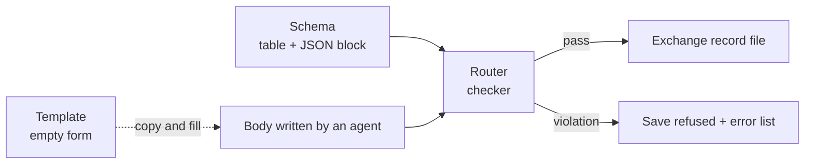

# task-and-record-schema

## overview

**Scope:** Extended mode specification. Basic operation follows the [setup guide](../Setup/README.md#도입-모드). Adopting this specification does not mean the Router has been implemented or tested.

Defines the kinds, frontmatter fields, body sections, and cross-document rules AI work documents must have. Where the documents are used is in [document system](../Architecture/Document_System_admin.md#작업-문서).

| Section | Content | Applies |
|---|---|---|
| [what-is-a-schema](#what-is-a-schema) | What a schema is and how it differs from templates and checkers | Extended spec |
| [document-kinds](#document-kinds) | Primary task and exchange record kinds | Extended spec |
| [primary-task-fields](#primary-task-fields) | TaskNote frontmatter | Extended spec |
| [exchange-record-fields](#exchange-record-fields) | Exchange record frontmatter | Extended spec |
| [ids-and-filenames](#ids-and-filenames) | Task IDs, record file names, numbering | Extended spec |
| [versions](#versions) | Version fields and their relation to runs | Extended spec |
| [invariants](#invariants) | Rules that must always hold across documents | Extended spec |
| [machine-readable-block](#machine-readable-block) | JSON rules the Router reads | Extended spec |
| [schema-changes](#schema-changes) | How to change the schema, and why documents carry no per-document version field | Extended spec |
| [related-documents](#related-documents) | Router and record format | Extended spec |

## what-is-a-schema

**A schema is an agreement stating "which fields a document of this kind must have, and which values each field may hold."** For measurement data, it is the definition sheet fixing a CSV's column names, units, and allowed ranges. There may be hundreds of data files but only one definition sheet, and the checker passes or rejects files against it.

| Layer | Defines | Example | Without this layer |
|---|---|---|---|
| Document kind | Which records exist | `plan`, `evaluation`, `execution` | Each agent records under different names and they drop out of views |
| Fields | Frontmatter fields and allowed values per kind | evaluation `verdict` is one of `pass`, `revise`, `hq-required` | A machine cannot read `verdict: passed` |
| Body sections | Required `##` headings per kind | evaluation has inputs, [required conditions](Roles/Evaluator_agent.md#required-conditions), scores, findings, verdict grounds | Only a verdict remains, without grounds |
| Invariants | Rules across documents | An executed plan must have a pass evaluation | An unevaluated plan gets executed |

| Term | Meaning | File |
|---|---|---|
| Schema | Rules: what a valid document is | This document |
| Template | An empty form that satisfies the rules | Task and exchange record templates in [`{templates}`](../Architecture/Company_Profile_admin.md#작업-공간-경로) |
| Checker | A program that checks documents against the rules | `check` and `new-record` of the [Router](Routing_agent.md#router-role) |



A failed check prints output like this (hypothetical example).

```text
router new-record ... → exit code 2
T-260915-A7F2 evaluation save refused
  E-REQ   verdict missing (required field for evaluation)
  E-ENUM  verdict: passed → allowed values pass, revise, hq-required
  E-REF   responds_to is not a plan: T-260915-A7F2_R01_001_instruction
```

## document-kinds

Today the only AI work document kind is the primary task, i.e., the [TaskNote](../Architecture/Document_System_admin.md#작업-문서).

### exchange-record-kinds-extended

| Kind | Writer role | Purpose | Required `##` sections | `responds_to` |
|---|---|---|---|---|
| `instruction` | Coordinator | Fix this run's contract and inputs | HQ original text · Contract · Approval snapshot · Inputs | None |
| `plan` | Planner | Execution plan | Assumptions · Alternatives · Work steps · Completion criteria mapping · Budget · Stop and recovery. Revisions start with Finding responses | None at first; revisions respond to `evaluation` |
| `evaluation` | Evaluator | Plan evaluation | Inputs · Required conditions · Scores · Findings · Verdict grounds | `plan` |
| `decision-request` | Coordinator | Snapshot of the decision request shown to HQ | Decision needed · Options · AI recommendation · If no response · Resume point | None, `evaluation`, `execution`, `verification` |
| `decision-response` | Coordinator | HQ's original response and approval scope | HQ original text · Adopted · Approval scope · Dispatch | `decision-request` |
| `execution` | Executor | Execution commands, environment, results | Execution steps · Commands and environment · Changed paths · Results and errors · receipt | `plan` |
| `verification` | Evaluator | Results checked against completion criteria | Completion criteria check · Reproduction check · Residual uncertainty · Verdict grounds | `execution` |
| `report` | Coordinator | Results, changed files, handoff | Results · Changed files · Verification · Unresolved · Next handoff | None, `verification`, `decision-response` |

Existing primary tasks have no `doc_kind` field; a missing field means a primary task. Existing tasks directly under the task folder are accepted as legacy.

## primary-task-fields

| Field | Value | Meaning |
|---|---|---|
| `title` | Same as the file name | Task name and ID |
| `tags` | `task`, `ai` | Lets the task management tool find and group AI tasks |
| `status` | `to-do`, `in-progress`, `done` | Task management status |
| `owner` | `ai`, [`{hq-owner}`](../Architecture/Company_Profile_admin.md#사람과-역할-배정), `none` | Next actor. `none` means closed |
| `hq_todo` | `none`, `decide`, `dispatch`, `review` | What HQ must do now |
| `risk` | `0`, `1`, `2` | [Risk level](../Architecture/Risk_and_Authority_admin.md#위험도) |
| `llm_model` | Model name | Model that wrote this TaskNote |
| `proposal_version`, `approved_version` | Proposals are `V<major>.<minor>.<patch>`; unapproved is `approved_version: ""` | Proposed and approved versions ([versions](#versions)) |
| `recommended_model` | A value from the company model list | Recommended model for the difficulty of the work |
| `execution_mode` | `autonomous`, `after-approval`, `manual` | [Execution mode](../Architecture/Risk_and_Authority_admin.md#실행-모드) |
| `report_policy` | `decision-only`, `milestone`, `final` | [Report policy](../HQ/Control_Settings_admin.md#보고-정책) |
| `blockedBy` | List of task links | Task dependencies blocking execution. External conditions go in the current-state body (optional) |
| `projects` | Values from [project keys](../Architecture/Company_Profile_admin.md#프로젝트-키) | Grouping |
| `write_scope` | List of paths | [Write scope](../HQ/Control_Settings_admin.md#쓰기-범위) |
| `scheduled`, `due` | Task management tool values | Optional |

`status`, `owner`, and `hq_todo` allow only the six combinations in [task states](../Architecture/Command_and_Report_Flow_admin.md#작업-상태). Key order and the remaining optional fields follow [TaskNote fields](../Architecture/Frontmatter_admin.md#tasknote-필드).

### primary-task-field-changes-extended

| Candidate | Decision | Reason |
|---|---|---|
| `task_id` | **Add** | Used as the record file name prefix instead of a long title. Record names survive title changes |
| `blocked_by` | Retired key, replaced by `blockedBy` | Existing external conditions are kept in the body |
| `doc_kind` | Not added | A missing field means a primary task |
| `schema_version` | Fixed in each run's instruction body instead of a per-record field | [Schema changes](#schema-changes) |
| `project_key` | Not added | The storage folder is the project key |
| `task_type` | On hold | Add as an optional field once a view uses it |
| `workflow_state`, `wait_reason`, `resume_from` | Not added | Kept in the stage line of `# 현재 상태` and the checkpoint |

## exchange-record-fields

Frontmatter holds only values a machine uses to branch, check, or filter; values available elsewhere are omitted.

| Field | Applies to | Value |
|---|---|---|
| `doc_kind` | All | One of the 8 [exchange record kinds](#exchange-record-kinds-extended) |
| `parent_task` | All | Full-path link to the primary task |
| `responds_to` | Kinds the table allows | Full-path link to a record of the same task |
| `verdict` | `evaluation`, `verification` | evaluation: `pass`, `revise`, `hq-required` · verification: `pass`, `fail`, `inconclusive` |

Records carry no `title`, `tags`, `status`, `owner`, or `hq_todo`, and are not indexed as tasks in the task management tool. Input hashes, scores, findings, and execution commands go in the body.

```yaml
# File: <task-folder>/PRJ1/R/T-260915-A7F2_R01_003_evaluation.md (hypothetical example)
doc_kind: evaluation
parent_task: "<full-path link to the primary task>"
responds_to: "<full-path link to T-260915-A7F2_R01_002_plan>"
verdict: revise
```

## ids-and-filenames

For a primary task, the file name is both title and ID ([naming rules](../Architecture/Company_Profile_admin.md#명명-규칙)).

### record-ids-extended

| Target | Rule | Example |
|---|---|---|
| `task_id` | `T-` + creation date `YYMMDD` + `-` + 4 uppercase hex digits. Router checks collisions | `T-260915-A7F2` |
| Record file name | `<task_id>_R<2-digit run>_<3-digit sequence>_<doc_kind>.md`. The file name is the record ID | `T-260915-A7F2_R01_003_evaluation.md` |
| run | Increments by 1 on each new `instruction`, excluding duplicate resends | `R01` → `R02` |
| Sequence | Increments from 1 across the whole task. Continues across runs and is never reused | `001`, `002` |
| Finding ID | Stable within a task. The same defect reappearing keeps the same ID | `F02` |

## versions

A primary task's `proposal_version` and `approved_version` use the form `V<major>.<minor>.<patch>`. The criteria for bumping versions are defined only in the [version rules](../HQ/Commands_and_Approval_admin.md#버전-규칙).

### runs-and-versions-extended

| Change | Contract version | run |
|---|---|---|
| Wording fix with no change in meaning | patch | Kept |
| Scope, criteria, authority, or budget change | minor | New instruction → new run |
| Goal change | major | New instruction → new run |
| Plan revision, re-evaluation, re-execution | No change | Kept (only the sequence increments) |

## invariants

| ID | Rule | Check |
|---|---|---|
| I1 | The parent task exists and the record is inside `R/` of that task's project storage folder. For a legacy parent, compute the storage folder from projects | Router |
| I2 | The `task_id` in the record file name equals the parent's `task_id` | Router |
| I3 | `responds_to` is an existing record of the same task and an allowed kind. evaluation, execution, and verification reference within the same run | Router |
| I4 | An evaluation with `verdict: pass` has no blocking row in its `## Findings` table | Router |
| I5 | The plan an extended-mode execution points to has a pass evaluation in the same run, and the plan, contract, and input hashes match. Light review creates no exchange records at all | Router |
| I6 | Published records are never edited. Corrections are new records whose first body line names the corrected record | Version control diff |
| I7 | When the contract's minor or major changes, a new run's instruction must exist before other records can be attached | Router |
| I8 | A primary task's `status`, `owner`, and `hq_todo` form one allowed combination | Router |
| I9 | Files in the template folder are not task-checked or indexed | Router, task management tool settings |
| I10 | Each run's instruction fixes the protocol commit, schema number, and profile hash. Published records are read with their original schema and never modified | Router |

## machine-readable-block

This block is the **extended mode schema** and is not considered an executable checker before the Router is implemented. Basic mode writes no exchange records and reads existing tasks as legacy. Existing external-condition sentences in `blocked_by` are kept in the body; `blockedBy` holds only a list of task links. Once implemented, the Router reads this block to check documents. If the tables above and this block differ, `check-schema` fails. The Router reads `{hq-owner}` as the value in the [company profile](../Architecture/Company_Profile_admin.md#사람과-역할-배정).

```json
{
  "schema": 1,
  "task": {
    "required": ["title", "status", "tags", "owner", "hq_todo", "risk", "llm_model", "proposal_version", "approved_version", "recommended_model", "execution_mode", "report_policy", "projects", "write_scope", "task_id"],
    "optional": ["scheduled", "due", "blockedBy"],
    "legacy_exempt": ["task_id"],
    "enums": {
      "status": ["to-do", "in-progress", "done"],
      "owner": ["ai", "{hq-owner}", "none"],
      "hq_todo": ["none", "decide", "dispatch", "review"],
      "risk": [0, 1, 2],
      "execution_mode": ["autonomous", "after-approval", "manual"],
      "report_policy": ["decision-only", "milestone", "final"]
    },
    "state_combinations": [
      ["to-do", "{hq-owner}", "decide"],
      ["to-do", "{hq-owner}", "dispatch"],
      ["to-do", "ai", "none"],
      ["in-progress", "ai", "none"],
      ["in-progress", "{hq-owner}", "review"],
      ["done", "none", "none"]
    ],
    "patterns": {
      "task_id": "^T-[0-9]{6}-[0-9A-F]{4}$",
      "proposal_version": "^V[0-9]+\\.[0-9]+\\.[0-9]+$",
      "approved_version": "^(V[0-9]+\\.[0-9]+\\.[0-9]+)?$"
    }
  },
  "record": {
    "common_required": ["doc_kind", "parent_task"],
    "filename": "^(T-[0-9]{6}-[0-9A-F]{4})_R([0-9]{2})_([0-9]{3})_([a-z-]+)\\.md$",
    "kinds": {
      "instruction": {"writer": "coordinator", "responds_to": [], "responds_to_required": false, "sections": ["HQ original text", "Contract", "Approval snapshot", "Inputs"]},
      "plan": {"writer": "planner", "responds_to": ["evaluation"], "responds_to_required": false, "sections": ["Assumptions", "Alternatives", "Work steps", "Completion criteria mapping", "Budget", "Stop and recovery"], "sections_if_responds_to": ["Finding responses"]},
      "evaluation": {"writer": "evaluator", "responds_to": ["plan"], "responds_to_required": true, "verdict": ["pass", "revise", "hq-required"], "sections": ["Inputs", "Required conditions", "Scores", "Findings", "Verdict grounds"]},
      "decision-request": {"writer": "coordinator", "responds_to": ["evaluation", "execution", "verification"], "responds_to_required": false, "sections": ["Decision needed", "Options", "AI recommendation", "If no response", "Resume point"]},
      "decision-response": {"writer": "coordinator", "responds_to": ["decision-request"], "responds_to_required": true, "sections": ["HQ original text", "Adopted", "Approval scope", "Dispatch"]},
      "execution": {"writer": "executor", "responds_to": ["plan"], "responds_to_required": true, "sections": ["Execution steps", "Commands and environment", "Changed paths", "Results and errors", "receipt"]},
      "verification": {"writer": "evaluator", "responds_to": ["execution"], "responds_to_required": true, "verdict": ["pass", "fail", "inconclusive"], "sections": ["Completion criteria check", "Reproduction check", "Residual uncertainty", "Verdict grounds"]},
      "report": {"writer": "coordinator", "responds_to": ["verification", "decision-response"], "responds_to_required": false, "sections": ["Results", "Changed files", "Verification", "Unresolved", "Next handoff"]}
    }
  }
}
```

## schema-changes

| Change | Schema number | Existing documents |
|---|---|---|
| Add an optional field | Kept; protocol version is bumped | Originals kept |
| Make required, rename, change meaning, add a record kind | +1 | New schema from the next run. Past records are checked with the schema of their protocol commit |

**Published exchange records are never bulk-converted.** The instruction's `## Contract` fixes `protocol_commit`, `schema_version`, and `profile_sha256`. Each record finds these values via task_id and run. Records made before first adoption are explicitly registered as schema 1 and kept as-is.

Only a primary TaskNote's mutable frontmatter is an approved conversion target, with a before/after mapping table and a backup. A past schema that cannot be read is reported as `unsupported schema`; never guess the latest format and overwrite.

Updating the repository and updating the company's operating version are separate ([version pinning](../Setup/Adoption_admin.md#버전-구분)).

## related-documents

- [Routing](Routing_agent.md) — the Router that checks this schema and creates files
- [Document system](../Architecture/Document_System_admin.md) — where the documents are used
- [Record format](Reporting_Style_agent.md) — format of the `# 기록` body
- [Workflow](Workflow_agent.md#records-by-stage) — records created at each stage
