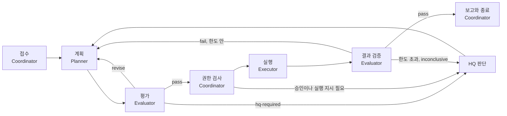
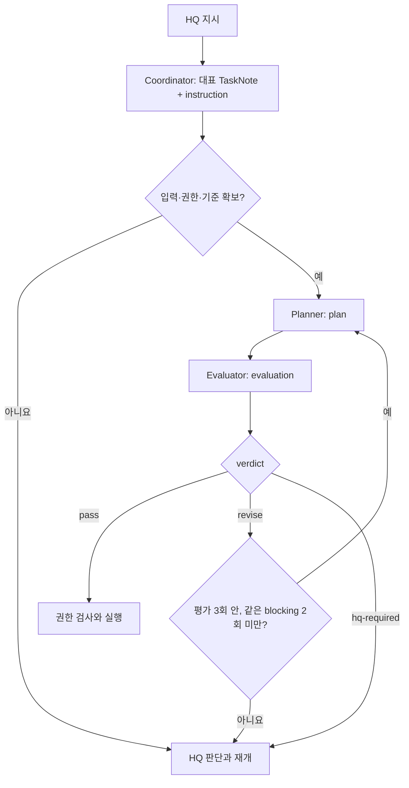
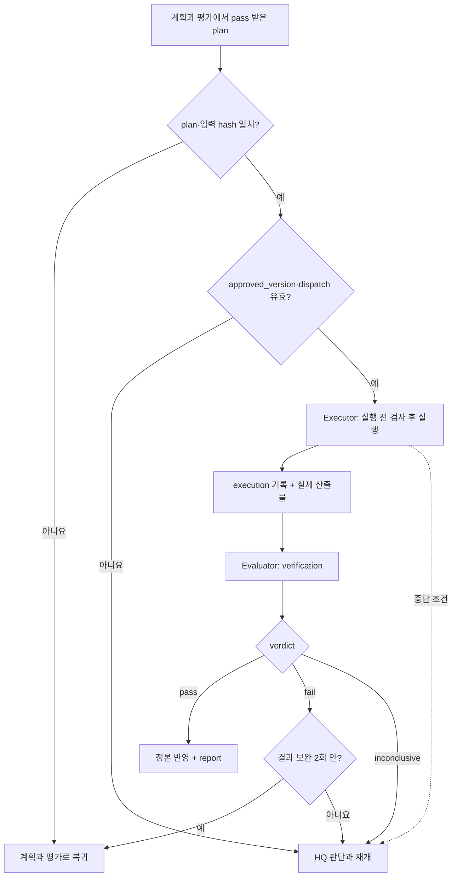
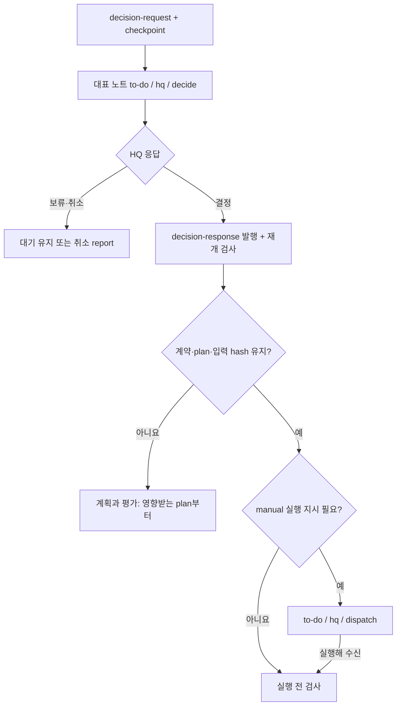

# 작업-흐름

## overview

AI 작업이 접수부터 종료까지 어떤 순서로 진행되고, 각 단계를 어느 역할이 맡는지 설명합니다. HQ 쪽에서 본 같은 흐름은 [명령과 보고 체계](../Architecture/Command_and_Report_Flow.md#전달-체계-한눈에)에 있습니다.

| 섹션 | 내용 | 적용 |
|---|---|---|
| [루프-한눈에](#루프-한눈에) | 현행 8단계 루프와 확장 역할 루프 | 운영 매뉴얼 |
| [접수](#접수) | 요청을 받아 작업을 준비 | 운영 매뉴얼 |
| [계획과-평가](#계획과-평가) | 계획 작성, 독립 평가, 수정 반복 | 운영 매뉴얼 |
| [권한-검사](#권한-검사) | 실행 전에 확인할 권한과 입력 | 운영 매뉴얼 |
| [실행](#실행) | 승인된 범위의 실행 | 운영 매뉴얼 |
| [결과-검증](#결과-검증) | 실제 결과와 완료 기준 대조 | 운영 매뉴얼 |
| [보고와-종료](#보고와-종료) | 기록, 정본 반영, 후속 제안, 종료 | 운영 매뉴얼 |
| [hq-판단과-재개](#hq-판단과-재개) | HQ 결정 대기와 재개 | 운영 매뉴얼 |
| [검토-깊이별-경로](#검토-깊이별-경로) | 경량·표준·엄격에서 생략되는 단계 | 운영 매뉴얼 |
| [단계별-기록](#단계별-기록) | 단계마다 남는 기록과 다음 주체 | 운영 매뉴얼 |
| [관련-문서](#관련-문서) | 역할 문서 | 운영 매뉴얼 |

## 루프-한눈에

현재 운영하는 루프입니다. AI Agent 하나가 모든 단계를 수행합니다.

| # | 단계 | 할 일 |
|---:|---|---|
| 1 | 접수 | 해당 [TaskNote](../Architecture/Document_System.md#작업-문서)를 만들거나 갱신하고 지시를 정리 |
| 2 | 읽기 | TaskNote, 가장 가까운 CONTEXT, 정본, HQ 노트, 결정을 읽음 ([참조 순서](Common_Rules.md#참조-순서)) |
| 3 | 확인 | [위험도](../Architecture/Risk_and_Authority.md#위험도), 실행 모드, 승인 버전, 백업, 쓰기 범위, 의존성. 쓰기 범위가 겹치는 작업은 동시에 실행하지 않음 |
| 4 | 실행 | 승인된 버전만 실행. manual인 위험도 2 작업은 실행 지시를 받은 뒤에만 |
| 5 | 기록 | `# 현재 상태`를 갱신하고 버전 붙은 기록을 추가 |
| 6 | 정본 반영 | 결과가 속하면 STATUS·Decisions·Wiki를 갱신 |
| 7 | 후속 | 미해결이나 인계가 남으면 중복 없는 다음 버전 제안을 바로 작성. 승인·검토 대기만 남았으면 만들지 않음 |
| 8 | 종료 | 원래 완료 기준과 검증을 충족한 뒤에만 `done / none / none`. HQ 검토가 남으면 `done / {hq-owner} / review` |

### 역할-루프-확장

| 단계 | 맡는 역할 | 이 문서의 섹션 |
|---|---|---|
| 접수 | [Coordinator](Roles/Coordinator.md#접수) | [접수](#접수) |
| 계획과 평가 | [Planner](Roles/Planner.md#계획서-필수-구획), [Evaluator](Roles/Evaluator.md#필수-조건) | [계획과 평가](#계획과-평가) |
| 권한 검사 | Coordinator, [Executor](Roles/Executor.md#실행-전-검사) | [권한 검사](#권한-검사) |
| 실행 | Executor | [실행](#실행) |
| 결과 검증 | Evaluator | [결과 검증](#결과-검증) |
| 보고와 종료 | Coordinator | [보고와 종료](#보고와-종료) |

## 접수

HQ 요청을 받으면 행동하기 전에 TaskNote를 만들거나 갱신하고, 지시를 목표·산출물·자료·범위·제외·완료 기준·검증 방법으로 정리합니다. 단계별 표는 [지시 흐름](../Architecture/Command_and_Report_Flow.md#지시-흐름)에 있습니다.

### 접수-조항-확장

| 할 일 | 조항 |
|---|---|
| [Router](Routing.md#router의-역할)로 TaskNote 생성, 분할 기준 적용 | [접수](Roles/Coordinator.md#접수) |
| 지시를 [작업 계약](Roles/Coordinator.md#계약-정규화)으로 고정 | CO-111–CO-114 |
| 검토 깊이 결정 | [검토 깊이와 위험도](Roles/Coordinator.md#검토-깊이와-위험도) |
| instruction 기록 발행과 입력 hash 고정 | [기록 발행과 입력 고정](Roles/Coordinator.md#기록-발행과-입력-고정) |
| 의존성·동시 실행·기밀 검사 | [호출 전 검사](Roles/Coordinator.md#호출-전-검사) |

## 계획과-평가

| 단계 | 누가 | 할 일 | 정의 |
|---|---|---|---|
| 계획 작성 | Planner | 가정·대안·작업 단계·완료 기준 대응·예산·중단과 복구를 채움 | [계획서 필수 구획](Roles/Planner.md#계획서-필수-구획) |
| 평가 | Evaluator | 새 문맥에서 [필수 조건](Roles/Evaluator.md#필수-조건), 점수, 발견을 기록하고 판정 | [통과 조건](Roles/Evaluator.md#통과-조건) |
| 수정 | Planner | 발견마다 수용·반박·HQ 판단 필요를 적은 반영표와 새 plan | [지적 반영표](Roles/Planner.md#지적-반영표) |
| 한도 | Evaluator, Coordinator | 평가 3회 미통과나 같은 blocking 2회 반복이면 HQ 보고와 제안서 | [반복 한도](Roles/Evaluator.md#반복-한도) |

## 권한-검사

실행 전에 위험도, [실행 모드](../Architecture/Risk_and_Authority.md#실행-모드), 승인 버전, [백업](Common_Rules.md#백업), [쓰기 범위](../HQ/Control_Settings.md#쓰기-범위), 의존성을 확인합니다. 위험도 1–2 작업은 결과, 제외, 승인 버전, 중단 조건, 보고 시점을 `# 현재 상태`에 먼저 적습니다.

### 실행-전-검사-확장

[과정 역할](../Architecture/Organization.md#과정-역할)을 도입하면 Executor가 plan·입력 hash, 승인·실행 지시 기록, 경로 잠금을 포함한 여덟 가지를 확인한 뒤에만 시작합니다 ([실행 전 검사](Roles/Executor.md#실행-전-검사), [잠금과 예산](Roles/Coordinator.md#잠금과-예산)).

## 실행

승인된 버전만, 쓰기 범위 안에서 실행합니다. 파일은 [파일 작업](Common_Rules.md#파일-작업) 규칙을 따르고, HQ의 `중단:`을 받으면 안전한 지점에서 멈춥니다.

### 실행-흐름-확장

Executor는 단계마다 intent와 receipt를 남기고 명령·환경·변경 경로·hash를 모읍니다 ([실행](Roles/Executor.md#실행), [증거 수집](Roles/Executor.md#증거-수집), [중단](Roles/Executor.md#중단)).

## 결과-검증

Evaluator가 실제 산출물을 원래 완료 기준과 대조하고, 한 가지 이상의 독립 검사를 한 뒤 판정합니다.

| 판정 | 조건 | 다음 |
|---|---|---|
| `pass` | 모든 완료 기준 충족, 독립 검사 일치 | [보고와 종료](#보고와-종료) |
| `fail` | 하나 이상 미충족 | 같은 기준·범위 안에서 2회까지 보완, 넘으면 HQ |
| `inconclusive` | 필수 검증을 할 수 없음, 산출물 hash 불일치 | HQ |

세부 조항은 [완료 기준 대조](Roles/Evaluator.md#완료-기준-대조), [재현 검사](Roles/Evaluator.md#재현-검사), [검증 판정과 보완 한도](Roles/Evaluator.md#검증-판정과-보완-한도), [연구 증거 추적](Roles/Evaluator.md#연구-증거-추적)에 있습니다.

## 보고와-종료

| 할 일 | 정의 |
|---|---|
| `# 현재 상태` 갱신과 버전 붙은 기록 추가 | [기록 구조](Reporting_Style.md#기록-구조) |
| 결과를 STATUS·Decisions·Wiki에 반영 | [정본 승격 확인](../HQ/Review_and_Closure.md#정본-승격-확인) |
| 미해결·인계가 있으면 [후속 제안](../HQ/Review_and_Closure.md#후속-제안-처리) | 같은 곳 |
| 완료 기준과 검증을 모두 충족하면 닫음 | [작업 상태](../Architecture/Command_and_Report_Flow.md#작업-상태) |

### 보고-기록-확장

과정 역할을 도입하면 Coordinator가 verification pass 뒤에 report 기록을 발행하고 대표 노트를 갱신합니다 ([종료](Roles/Coordinator.md#종료)).

## hq-판단과-재개

결정이 필요하면 [결정표](../HQ/Commands_and_Approval.md#결정표-작성)를 쓰고 `hq: decide`로 바꾼 뒤 멈춥니다. 응답이 없으면 기다리며 승인 없는 기본값으로 실행하지 않습니다. manual 작업은 승인 뒤에도 실행 지시를 기다립니다.

### 재개-흐름-확장

그림의 `hq`는 [`{hq-owner}`](../Architecture/Company_Profile.md#사람과-역할-배정) 값입니다. 올리는 조건, 결정 요청 형식, checkpoint는 [HQ로 올리는 조건](Roles/Coordinator.md#hq로-올리는-조건), [결정 요청 형식](Roles/Coordinator.md#결정-요청-형식), [checkpoint와 재개](Roles/Coordinator.md#checkpoint와-재개)에 있습니다.

## 검토-깊이별-경로

| [검토 깊이](../Architecture/Risk_and_Authority.md#검토-깊이) | 경로 | 생략하는 것 |
|---|---|---|
| 경량 | TaskNote 접수 → 권한 확인 → 실행 → 결과 확인 → 기록 | 교환 기록을 생성하지 않음. plan·evaluation·execution·verification 파일 불필요 |
| 표준 | 접수 → 계획과 평가 → 권한 검사 → 실행 → 결과 검증 → 보고 | 없음 |
| 엄격 | 표준 + HQ 권한 확인 + 작업별 검증 강화 | 없음 |

기본 모드는 모든 내용을 TaskNote에 남깁니다. 아래 단계별 교환 기록 표와 I5는 확장 모드 표준·엄격 경로에만 적용합니다. 경량 결과도 원래 완료 기준별 증거를 남기고, 독립 평가를 했다고 표시하지 않습니다. 모드 선택은 [설치 안내](../Setup/README.md#도입-모드)를 따릅니다.

통과한 계획을 HQ 승인 후 그대로 재개할 때에는 변화가 없음을 확인하고 기존 평가를 재사용합니다.

## 단계별-기록

| 단계 | 만들거나 갱신하는 기록 | 다음 주체와 조건 |
|---|---|---|
| 접수 | 대표 TaskNote, instruction | Planner — 필수 입력과 계약 확보 |
| 계획 n | plan n | Evaluator — 정확한 plan 파일명·hash 전달 |
| 평가 n | evaluation n | pass면 권한 검사, revise면 Planner |
| 수정 n+1 | 새 plan과 지적 반영표 | Evaluator — 이전 평가와 차이 검토 |
| HQ 판단 필요 | decision-request, 대표 결정표, checkpoint | HQ — 결정표 한 곳에서 응답 |
| HQ 응답 | decision-response, 필요하면 새 instruction | Coordinator — 입력·승인·예산 재검사 |
| 실행 | execution (명령·환경·변경 경로·hash) | Evaluator — 실제 결과 확인 |
| 결과 검증 | verification | fail이면 한도 안 보완, pass면 정본 반영 |
| 종료 | report, 대표 노트 현재 상태, 필요하면 STATUS·Decisions | HQ 검토 또는 종료 |

기록 종류의 필수 구획은 [교환 기록 종류](Task_and_Record_Schema.md#교환-기록-종류-확장)에 있습니다.

## 관련-문서

- [Coordinator](Roles/Coordinator.md) — 흐름을 운영하는 역할의 조항
- [명령과 보고 체계](../Architecture/Command_and_Report_Flow.md) — HQ 쪽에서 본 같은 흐름
- [작업과 기록 스키마](Task_and_Record_Schema.md) — 단계마다 만드는 문서의 형식
- [AI 안내](README.md) — AI 문서 목록
