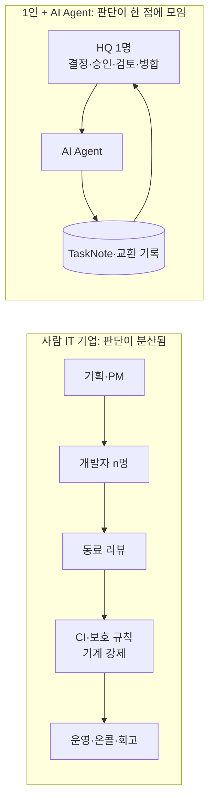

# ai-agent-1인기업과-it-기업-구조-비교

## overview

이 저장소의 프로토콜 전체를 읽고, 사람 여럿이 운영하는 IT 기업의 조직·프로세스와 비교한 분석입니다. 규칙 문서가 아니라 검토 결과이며 운영 효력이 없습니다. 프로토콜을 바꾸려면 [변경 절차](HQ/Protocol_Governance_admin.md#변경-절차)를 따릅니다.

| 섹션 | 내용 | 근거 |
|---|---|---|
| [검토-범위](#검토-범위) | 읽은 문서와 현재 적용 상태 | 저장소 전체 |
| [프로토콜이-실제로-정하는-것](#프로토콜이-실제로-정하는-것) | 통제 장치 8개로 압축 | Architecture·HQ·AI·Setup |
| [it-기업-구조와의-대응](#it-기업-구조와의-대응) | 조항별 업계 대응물 | 업계 일반 관행 |
| [강한-점](#강한-점) | 1인 + AI 구조의 구조적 우위 | 분석 |
| [약한-점](#약한-점) | 구조적 열위와 단일 병목 | 분석 |
| [프로토콜-성숙도-비교](#프로토콜-성숙도-비교) | 항목별로 업계보다 앞선 곳과 빈 곳 | 분석 |
| [핵심-차이-세-가지](#핵심-차이-세-가지) | 가장 중요한 결론 | 분석 |
| [시사점](#시사점) | 검토 체크리스트와 연결되는 관찰 | 분석 |
| [이-문서의-한계](#이-문서의-한계) | 확인한 것과 추정한 것의 구분 | 분석 |
| [관련-문서](#관련-문서) | 근거가 된 문서 | — |

## 검토-범위

| 대상 | 내용 |
|---|---|
| 문서 | 최상위 README, Architecture 10개, HQ 6개, AI 11개, Setup 4개 (총 32개, 약 4,650줄) |
| 코드 | [정적 검사기](tools/validate.py) 1개 (116줄, 표준 라이브러리만 사용) |
| 실행 구성요소 | 없음. Router, 스테이징, 잠금, checkpoint는 모두 설계 상태 |

**현재 실제로 작동하는 것과 제안 상태를 반드시 구분해야 합니다.** 지금 운영되는 것은 HQ 한 명 + AI Agent 하나의 8단계 루프이고, 위험도·실행 모드·작업 상태·기록 형식·파일 안전 규칙이 `adopted`입니다. 과정 역할 4개(Coordinator·Planner·Evaluator·Executor), 교환 기록, 스키마 검사, 잠금·재개, 평가 점수표는 전부 `proposed`이며 [적용 상태](Setup/Adoption_admin.md#적용-상태)상 `draft`입니다. 이 구분은 아래 비교 전체에 영향을 줍니다.

## 프로토콜이-실제로-정하는-것

4,650줄을 통제 장치 여덟 개로 압축하면 다음과 같습니다.

| # | 장치 | 핵심 규칙 | 상태 |
|---:|---|---|---|
| 1 | 단일 작업 단위 | [TaskNote](Architecture/Document_System_admin.md#작업-문서) 하나 = 결과 하나 = 승인 경계 하나. 별도 지시서·보고서 금지 | adopted |
| 2 | 위험 등급 | [위험도](Architecture/Risk_and_Authority_admin.md#위험도) 0·1·2로 문서 깊이와 승인 필요 여부를 결정. 애매하면 높은 쪽, 쪼개서 회피 금지 | adopted |
| 3 | 승인과 실행의 분리 | [실행 모드](Architecture/Risk_and_Authority_admin.md#실행-모드) autonomous·after-approval·manual. manual은 승인해도 `실행해`가 따로 필요 | adopted |
| 4 | 권한 경계 | `write_scope` 경로 제한, [기밀 영역](AI/Common_Rules_agent.md#confidentiality), [위임하지 않는 행위](Architecture/Risk_and_Authority_admin.md#위임하지-않는-행위) 7종 | adopted |
| 5 | 상태 기계 | `status`·`owner`·`hq_todo`의 [6개 조합](Architecture/Command_and_Report_Flow_admin.md#작업-상태)만 허용. `owner`는 항상 다음 행동 주체 | adopted |
| 6 | 역할 분리 | [과정 역할](Architecture/Organization_admin.md#과정-역할) 4개. 계획자와 평가자를 다른 문맥으로 분리, Coordinator만 대표 노트에 기록 | proposed |
| 7 | 불변 증거 | [교환 기록](Architecture/Document_System_admin.md#교환-기록) 8종, 발행 후 수정 금지, 입력 hash·commit·스키마 고정 ([불변식](AI/Task_and_Record_Schema_agent.md#invariants) I1–I10) | proposed |
| 8 | 검증 게이트 | [필수 조건](AI/Roles/Evaluator_agent.md#required-conditions) G1–G6, [점수표](AI/Roles/Evaluator_agent.md#scorecard) 5항목, [반복 한도](AI/Roles/Evaluator_agent.md#iteration-limit) 3회·2회 | proposed |

원칙은 네 줄입니다 — 기억은 문서에, 안전은 장치로, 통제는 명시적으로, 사람은 결정만 ([운영 원칙](Architecture/Operating_Model_admin.md#운영-원칙)).

## it-기업-구조와의-대응

읽으면서 확인한 것은, 이 프로토콜의 거의 모든 조항이 IT 기업이 이미 쓰는 장치와 1:1로 대응한다는 점입니다. 발명이 아니라 **사람 조직의 통제 장치를 1인 + 문서 환경으로 옮긴 번역**에 가깝습니다.

| AGENT_NODE_GOVERNANCE | IT 기업의 대응물 | 차이 |
|---|---|---|
| TaskNote 1개 = 승인 경계 1개 | Jira 티켓 + Definition of Done, Kanban WIP 제한 | 개념 동일. JM이 "티켓 하나에 결과 하나"를 더 엄격히 강제 |
| 위험도 0·1·2 | ITIL 변경 유형(standard·normal·emergency), 변경 영향도 등급 | JM에는 emergency(긴급 우회) 등급이 없음 |
| 20개 초과 일괄 수정 = 위험도 2 | 배포 배치 크기 제한, blast radius 제한 | 동일한 발상 |
| autonomous·after-approval·manual | CI 자동 배포 vs 수동 승인 게이트(환경 보호 규칙) | 개념 동일, 강제 주체가 서버가 아니라 문서 |
| `write_scope` | CODEOWNERS, 브랜치 보호, IAM 최소 권한 | JM은 선언만 하고 시스템이 막지 않음 |
| Planner ≠ Evaluator | 작성자 ≠ 리뷰어, self-merge 금지, 직무 분리(SoD) | 두 호출이 같은 모델이면 독립성이 약함 |
| G1–G6 게이트 | 설계 리뷰 체크리스트, 출시 준비 리뷰, 아키텍처 리뷰 보드 | 개념 동일 |
| 교환 기록 불변 + hash | 감사 로그, 빌드 provenance(SLSA), ADR | JM이 더 세밀함. 업계는 보통 코드에만 적용 |
| instruction이 commit·스키마·프로필 hash 고정 | lockfile, 재현 가능 빌드, policy-as-code 버전 고정 | 개념 동일 |
| [receipt와 재시도](AI/Roles/Executor_agent.md#receipts-and-retries), request-id 중복 방지 | 멱등 키, at-least-once 처리, outbox 패턴 | 분산 시스템 설계를 그대로 차용 |
| 잠금·lease, [checkpoint](AI/Roles/Coordinator_agent.md#checkpoint-and-resume) | 분산 잠금, Temporal·Airflow의 durable execution | 구현체 없이 규칙만 존재 |
| [Router](AI/Routing_agent.md#router-role)가 위반 시 저장 거부 | admission controller(OPA), pre-commit hook, CI 린터 | 미구현. 가장 큰 격차 |
| [예외 중심 보고](AI/Roles/Coordinator_agent.md#hq-reporting-points) | management by exception, 알림 정책, 온콜 에스컬레이션 | 동일 |
| [주의력 예산](HQ/HQ_Role_admin.md#주의력-예산) 10개 | 인지 부하 기반 팀 설계, 작은 PR 문화, 회의 예산 | JM이 수치로 명문화한 점이 더 앞섬 |
| [예산 30분·10회](HQ/Control_Settings_admin.md#예산과-반복-한도) | 타임박스, 스파이크 예산, 에러 버짓 | 동일 |
| `.trash`, 원본 덮어쓰기 금지 | soft delete, 보존 정책, 백업·복구(RPO/RTO) | 동일 |
| `ai/work` 브랜치, main은 HQ만 merge | 보호된 main + PR 병합, 릴리스 매니저 | 동일하되 서버 강제 없음 |
| [도입 모드](Setup/README.md#도입-모드) 기본·확장 | 점진적 도입, 성숙도 모델(crawl-walk-run) | 동일 |
| [파일럿·대응표·복구](Setup/Migration_admin.md#파일럿) | 마이그레이션 런북, dry-run, 롤백 계획 | 동일 |
| [지시의 출처](AI/Common_Rules_agent.md#instruction-sources) | 신뢰 경계, 프롬프트 인젝션 방어 | **대부분의 기업보다 앞섬** |

## 강한-점

| # | 강점 | 이유 | 유보 조건 |
|---:|---|---|---|
| 1 | 조정 비용이 0에 수렴 | 사람 n명의 소통 경로 n(n−1)/2가 사라짐. 스탠드업·스프린트 계획·부서 간 협의·인수인계 회의가 전부 불필요 | 대신 HQ↔Agent 왕복 1개가 모든 병목이 됨 |
| 2 | 문서를 읽는 비용이 싸짐 | 사람 조직에서 문서가 썩는 이유는 아무도 안 읽어서인데, Agent는 매 작업마다 CONTEXT·정본을 다시 읽음. "기억은 문서에"가 실제로 성립 | 참조 순서를 실제로 지키는지 확인할 장치는 없음 |
| 3 | 추적성이 사실상 공짜 | 입력 hash·명령·환경·receipt까지 남는 수준의 감사 기록은 사람 조직에서 비용 때문에 포기하는 항목 | `proposed` 구간 |
| 4 | 채용 지연·이탈·온보딩 비용 없음 | 처리량 확대가 3개월 채용 + 6개월 적응이 아니라 설정 변경. 퇴사에 따른 지식 손실 구조적으로 없음 | 확대해도 HQ 결정 수는 늘지 않음 (약점 1) |
| 5 | 인센티브 왜곡이 없음 | 평가자가 통과시켜서 얻는 이득이 없음. 영역 다툼·공적 가로채기·추정치 부풀리기·부서 KPI 충돌이 원천적으로 부재 | — |
| 6 | 되돌릴 수 있으면 승인을 줄여도 됨 | 산출물이 git 안의 텍스트라 오류 비용이 거의 0. 그래서 사람 조직보다 훨씬 적은 게이트로 운영 가능 | 바이너리·기밀·외부 발신에는 성립하지 않음 |
| 7 | 회사 운영 방식 자체가 복제 가능한 산출물 | 템플릿 + 채택 기록 + 정적 검사기로 조직 설계를 `git clone` 할 수 있음. 사람 조직의 문화는 복제 불가 | — |
| 8 | 유휴 비용이 0 | 인건비는 고정비지만 Agent는 안 쓰면 0. 반대로 필요할 때 밤새 돌릴 수 있음 | 호출 비용은 변동비로 관리 필요 |

## 약한-점

|   # | 약점                        | 사람 조직이 이 문제를 푸는 방식                        | 프로토콜의 현재 대응                                                                  |
| --: | ------------------------- | ----------------------------------------- | ---------------------------------------------------------------------------- |
|   1 | **처리량 상한이 HQ 한 명의 판단 속도** | 의사결정 위임 매트릭스(금액·영향 한도), 부서장 위임, 대리 결재     | [위임 범위](HQ/Control_Settings_admin.md#위임-범위)가 있으나 `proposed`. 금액·영향 기준 없음           |
|   2 | HQ 부재 시 전면 정지             | 대행자 지정, 온콜 로테이션, 타임아웃 자동 승인               | 없음. `hq_todo: decide`는 무한 대기                                                      |
|   3 | 독립 평가가 실제로는 독립이 아님        | 서로 다른 경력·이해관계를 가진 사람이 리뷰하므로 실패 모드가 다름     | [독립성](AI/Roles/Evaluator_agent.md#independence)이 상관 오류를 인정하고 반례 1개를 요구. 완화 수단이 얇음           |
|   4 | 평가 기준을 평가 대상이 스스로 채점      | 테스트 스위트·운영 지표·고객이 최종 심판. 프로세스 바깥에 있음      | 도구 증거 우선·독립 검사 1회 규정은 있으나 외부 심판이 문서 작업에는 부재                                  |
|   5 | **통제가 코드가 아니라 산문**        | IAM·브랜치 보호·admission controller가 물리적으로 차단 | 유일한 기계 검사는 문서 형식 검사. Router는 미구현                                             |
|   6 | Agent 준수는 균일하지 않음         | 사람은 체크리스트를 건너뛰고, CI는 절대 안 건너뜀             | Agent는 확률적으로 단계를 조용히 생략할 수 있는데 이를 잡을 게이트가 없음                                 |
|   7 | 작은 일에도 프로세스 세금            | 오타 수정 PR 자동 병합 같은 별도 레인                   | [경량 깊이](Architecture/Risk_and_Authority_admin.md#검토-깊이)가 있으나 요청마다 TaskNote는 여전히 필수 |
|   8 | 결과 → 프로세스 되먹임 없음          | 회고, 장애 사후분석, 지표 기반 기준 재조정                 | 3회·2회·4/5점 같은 수치가 "시범 초기값"인 채로 재조정 계획이 없음                                    |
|   9 | **인프라가 가장 약한 고리**         | 관리형 VCS·CI·아티팩트 저장소·잠금 서비스                | Dropbox 동기화 + submodule 15개 + 기기 1대 제약. 안전장치 계층이 오히려 사고 이력 보유                |
|  10 | 긴급 우회 경로 없음               | break-glass 절차 + 사후 검토                    | 위험도 2는 항상 승인 대기. 급할 때 규칙을 어기거나 멈추거나 둘 중 하나                                   |
|  11 | 우선순위·용량 계획 부재             | OKR, **로드맵**, 우선순위 루브릭, 용량 산정             | 주간 STATUS 훑기 하나                                                              |
|  12 | 암묵지는 여전히 한 사람 머릿속         | 동료가 이상 징후를 알아챔                            | 결정은 남지만 "왜 그 방향이 좋은가"의 감각은 기록 대상이 아님                                         |

## 프로토콜-성숙도-비교

왼쪽은 판단을 여러 사람과 기계 게이트에 나눠 담고, 오른쪽은 모든 판단을 한 노드로 모읍니다. 그래서 왼쪽의 과제는 정렬(alignment)이고 오른쪽의 과제는 **한 사람의 주의력과 되돌릴 수 없는 행위** 두 가지뿐입니다. 프로토콜의 무게 중심이 위험도·승인·기록에 쏠려 있고 인사·소통·계획에 아무 조항이 없는 이유가 여기 있습니다.

| 항목        | IT 기업의 일반적 장치    | AGENT_NODE_GOVERNANCE           | 판정                                                                  |
| --------- | ---------------- | --------------------- | ------------------------------------------------------------------- |
| 작업 추적     | 티켓 + DoD         | TaskNote + 완료 기준      | 동등                                                                  |
| 변경 관리     | ITIL 3등급 + CAB   | 위험도 3등급, CAB 불필요      | 동등 (긴급 등급만 결손)                                                      |
| 직무 분리     | 작성자 ≠ 리뷰어, 서버 강제 | 역할 분리, 문서 강제          | 개념 동등, 강제력 약함                                                       |
| 감사·추적성    | 코드 중심            | 판단 과정까지               | **POD 우위**                                                           |
| 지식 관리     | 위키 (부패 전제)       | 정본 1곳 + 중복 금지 + 링크 검사 | **POD 우위**                                                           |
| 온보딩       | 문서 + 사수          | 독자별 읽는 순서             | **POD 우위**                                                           |
| 프로세스 거버넌스 | 대개 Slack 공지      | 버전 규칙 + 채택 기록 + DEC   | **POD 우위**                                                           |
| AI 신뢰 경계  | 정책 미비가 흔함        | 지시의 출처·외부 전송 금지 명문화   | **POD 우위**                                                           |
| 권한 강제     | IAM·브랜치 보호       | 선언만                   | **POD 열위**                                                           |
| 품질 판정 기준  | 테스트·운영 지표        | 모델 판정 + 점수표           | **POD 열위**                                                           |
| 릴리스·롤백    | 환경 분리·카나리        | 해당 없음                 | 결손 (연구 기업이라 타당)                                                     |
| 인시던트·온콜   | 정식 체계            | 없음                    | 결손 ([맞지 않는 경우](Architecture/Operating_Model_admin.md#이-모델이-맞지-않는-경우)에 명시) |
| 회고·개선 루프  | 스프린트 회고·사후분석     | 후속 제안뿐                | **결손**                                                              |
| 우선순위·용량   | OKR·로드맵          | 주간 STATUS             | 결손                                                                  |
| 부재·대행     | 대행자·에스컬레이션       | 없음                    | **결손**                                                              |

요약하면 **문서 거버넌스는 업계 상위, 실행 인프라는 업계 하위**입니다. 이 조합의 전형적 실패는 "규정은 완벽한데 실제로는 아무것도 강제되지 않는" 상태이고, 프로토콜 자신도 검사 성공이 운영 승인을 대신하지 않는다고 적어 두었습니다.

## 핵심-차이-세-가지

1. **처리량의 단위가 바뀝니다.** 사람 기업의 처리량은 "일하는 사람 수"지만, 이 구조의 처리량은 "HQ가 주당 내리는 좋은 결정의 수"입니다. Agent를 아무리 늘려도 이 상한은 움직이지 않습니다. 따라서 모든 설계는 "HQ 결정을 줄이거나 질을 높이는가"로 평가해야 하고, 그 기준에서 예외 중심 보고와 10개 상한은 정확한 선택입니다. 반면 commit·push를 위험도 2로 둔 것은 **빈번하고 되돌릴 수 있는 행위에 가장 비싼 자원을 쓰는** 배치라서 재검토 여지가 있습니다.

2. **검증이 병목으로 이동합니다.** 사람 조직은 생산이 비싸고 검토가 상대적으로 쌉니다. Agent를 쓰면 생산 비용이 급락하므로 병목은 "이 결과를 믿어도 되는가"로 옮겨 갑니다. 프로토콜이 Evaluator·검증·증거 추적에 가장 많은 분량을 쓴 것은 이 이동을 정확히 읽은 결과입니다. 문제는 그 부분이 전부 `proposed`이고, 판정자가 생산자와 같은 모델이라는 점입니다.

3. **통제를 산문에서 코드로 옮기는 것이 남은 최대 과제입니다.** IT 기업의 안전은 "규칙을 지키자"가 아니라 "지키지 않으면 서버가 거부한다"에서 옵니다. 현재 기계가 강제하는 것은 문서 형식뿐이고, `write_scope`·승인 버전·삭제 금지·기밀 경계는 모두 Agent의 자발적 준수에 의존합니다. [Router](Architecture/Workspace_and_Tools_admin.md#런타임과-router)와 실행 전 검사가 구현되는 시점이 이 조직의 실질적 성숙 시점입니다.

## 시사점

관찰이며 제안 조항이 아닙니다. 승인이 필요하면 [관리자 검토 체크리스트](README.md#관리자-검토-체크리스트)의 해당 항목에서 다룹니다.

| 관찰                                                                                           | 관련 항목       |
| -------------------------------------------------------------------------------------------- | ----------- |
| 기계 강제가 없는 동안에는 "확장 모드 활성화"보다 [실행 전 검사](AI/Roles/Executor_agent.md#pre-execution-check) 몇 개를 스크립트로 옮기는 편이 효과가 큼 | C3, C5      |
| HQ 부재·응답 지연을 다루는 경로가 비어 있음. 보류 유지가 유일한 결말                                                    | C2, C7      |
| 평가 수치(3회·2회·4/5)는 재조정 근거를 모으는 방법이 정해져야 의미가 생김                                                | C6          |
| 되돌릴 수 있는 git 행위와 되돌릴 수 없는 행위(force push·이력 재작성·외부 발신)를 같은 위험도 2로 묶은 점                        | C2          |
| 동기화·submodule·단일 기기 제약은 안전장치가 아니라 현재 최대 위험원                                                  | C8          |
| 문서 품질·거버넌스는 이미 업계 평균 이상. 추가 문서보다 실행 계층 구현이 한계 요인                                             | C3, C5, C10 |

## 이-문서의-한계

- **확인된 사실:** 저장소 문서 32개와 검사기 1개의 내용, 각 조항의 `adopted`·`proposed` 표시, 미구현 구성요소 목록. 모두 이 저장소에서 직접 읽었습니다.

- **추정:** IT 기업 대응물은 널리 알려진 일반 관행에 기댄 비교이며 특정 기업의 내부 규정을 근거로 하지 않습니다. 강점·약점의 상대 크기는 측정값이 아닙니다.

- **확인 필요:** 실제 운영에서 Agent가 참조 순서·쓰기 범위·백업 규칙을 얼마나 지키는지에 대한 데이터가 없습니다. 약점 6은 이 데이터가 나와야 확정됩니다.

- **AI 권장:** 위 시사점 표의 첫 줄(실행 전 검사 일부를 스크립트로 이전)이 투입 대비 효과가 가장 크다고 봅니다. 선택은 HQ가 합니다.

## 관련-문서

- [AGENT_NODE_GOVERNANCE 안내](README.md) — 전체 문서 지도와 승인 체크리스트
- [운영 모델](Architecture/Operating_Model_admin.md) — 이 구조가 나온 전제와 적용 한계
- [위험도와 권한](Architecture/Risk_and_Authority_admin.md) — 비교의 중심이 된 통제 장치
- [조직 구조](Architecture/Organization_admin.md) — 역할 분리와 [책임 매트릭스](Architecture/Organization_admin.md#책임-매트릭스)
- [설치와 도입](Setup/README.md) — 기본·확장 모드의 경계
