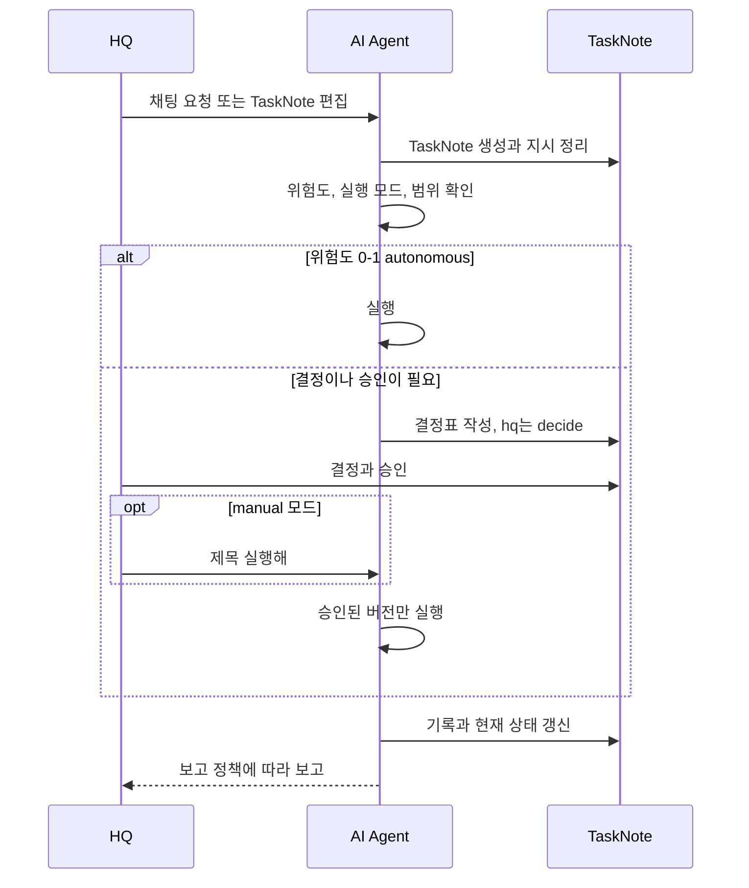
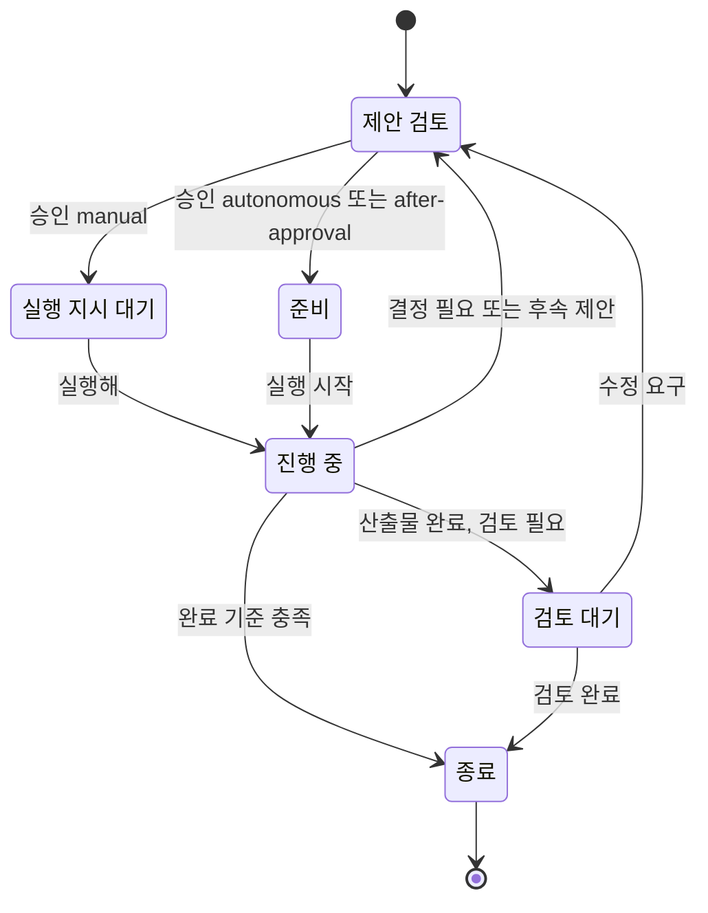
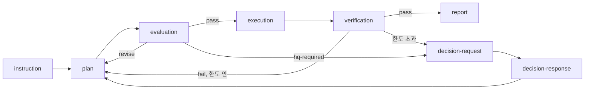

# 명령과-보고-체계

## overview

[HQ](Operating_Model_admin.md#hq와-ai의-뜻)와 AI Agent 사이에서 지시·결정·실행 지시·보고가 오가는 길을 설명합니다. 모든 전달은 작업마다 하나인 [TaskNote](Document_System_admin.md#작업-문서)에 모입니다.

| 섹션 | 내용 | 적용 |
|---|---|---|
| [전달-체계-한눈에](#전달-체계-한눈에) | 전체 흐름도와 전달물 표 | 운영 매뉴얼 |
| [지시-흐름](#지시-흐름) | HQ 요청이 정리된 지시가 되기까지 | 운영 매뉴얼 |
| [결정과-승인-흐름](#결정과-승인-흐름) | 결정 요청, HQ 결정, 승인 기록 | 운영 매뉴얼 |
| [실행-지시-흐름](#실행-지시-흐름) | 승인 후 실행을 시작하고 멈추는 법 | 운영 매뉴얼 |
| [보고-흐름](#보고-흐름) | 기록, 정본 반영, 후속 제안 | 운영 매뉴얼 |
| [작업-상태](#작업-상태) | 상태 조합 6개와 전이 | 운영 매뉴얼 |
| [교환-기록-흐름](#교환-기록-흐름) | 역할 사이 기록 전달 | 운영 매뉴얼 |
| [관련-문서](#관련-문서) | 명령·승인의 상세 문서 | 운영 매뉴얼 |

## 전달-체계-한눈에

| 방향 | 전달물 | 두는 곳 |
|---|---|---|
| HQ → AI | 지시 | 채팅 또는 TaskNote `# 지시` |
| AI → HQ | 결정 요청 | TaskNote `# 결정 및 승인`의 [결정표](../HQ/Commands_and_Approval_admin.md#결정표-작성) |
| HQ → AI | 결정과 승인 | 같은 결정표, 또는 채팅 `승인:` |
| HQ → AI | 실행 지시 | 채팅 `<제목> 실행해` |
| AI → HQ | 보고 | TaskNote `# 기록`과 채팅 최종 보고 |

지시·승인·실행·보고는 모두 TaskNote 한곳에서 관리하며, 별도 대기열·지시서·보고서 파일을 두지 않습니다.

## 지시-흐름

| 순서 | 누가 | 할 일 | 결과 |
|---:|---|---|---|
| 1 | HQ | 채팅으로 요청하거나 TaskNote를 편집 | Agent가 해당 TaskNote를 만들거나 갱신 |
| 2 | AI Agent | 행동하기 전에 지시를 정리: 목표, 산출물, 자료, 범위, 제외, 완료 기준, 검증 방법 | `# 지시`가 명확해짐 |
| 3 | AI Agent | 가장 가까운 [CONTEXT](Document_System_admin.md#정본-문서)와 정본을 읽고, [위험도](Risk_and_Authority_admin.md#위험도), 의존성, 백업, [쓰기 범위](../HQ/Control_Settings_admin.md#쓰기-범위) 겹침을 확인 | `# 현재 상태`가 최신 |

- **작업 단위:** TaskNote 하나에는 결과 하나와 승인 경계 하나만 둡니다. 서로 독립된 산출물이 있거나 HQ 결정·행동이 10개를 넘으면 나눕니다.

- **제목:** 해야 할 일을 바로 나타내는 제목을 씁니다 ([명명 규칙](AGENT_NODE_GOVERNANCE/Architecture/Company_Profile_admin.md#명명-규칙)).

- **초안만 원할 때:** HQ가 `초안:`으로 요청하면 결정 대기에서 멈춥니다 ([채팅 명령](../HQ/Commands_and_Approval_admin.md#채팅-명령)).

지시를 [작업 계약](../AI/Roles/Coordinator_agent.md#contract-normalization)으로 고정하는 확장 세부 조항은 Coordinator의 계약 정규화 조항(CO-111–CO-114)에 있습니다.

## 결정과-승인-흐름

|  순서 | 누가       | 할 일                                   | 상태                              |
| --: | -------- | ------------------------------------- | ------------------------------- |
|   1 | AI Agent | 위험도 2이거나 범위·결과가 바뀌면 결정표를 쓰고 멈춤        | `to-do / {hq-owner} / decide`   |
|   2 | HQ       | 결정 칸을 채우거나 `승인: <제목> <버전>, Q1=A…`를 보냄 | —                               |
|   3 | AI Agent | 결정과 `approved_version`을 기록            | 실행 모드에 따라 달라짐                   |
|  4a | AI Agent | after-approval이면 승인이 실행 권한도 줌         | `to-do / ai / none`             |
|  4b | AI Agent | manual이면 실행 지시를 기다림                   | `to-do / {hq-owner} / dispatch` |

`{hq-owner}` 값은 [회사 프로필](AGENT_NODE_GOVERNANCE/Architecture/Company_Profile_admin.md#사람과-역할-배정)에 있습니다. HQ가 `수정:`을 보내면 AI Agent는 제안 버전을 올리고 이전 승인을 무효로 한 뒤 다시 결정 대기로 돌아갑니다 ([수정과 중단](../HQ/Commands_and_Approval_admin.md#수정과-중단)).

## 실행-지시-흐름

- **승인과 실행은 다릅니다.** [실행 모드](Risk_and_Authority_admin.md#실행-모드)가 manual이면 승인은 계획만 기록하고, HQ가 `<제목> 실행해`를 보내야 실행이 시작됩니다.

- **실행 전 확인:** 위험도 1–2 작업은 실행 전에 `# 현재 상태`에 결과, 제외, 승인 버전, 중단 조건, 보고 시점을 적습니다.

- **실행 중:** 상태는 `in-progress / ai / none`이며, AI Agent는 승인된 버전의 범위만 실행합니다.

- **중단:** HQ가 `중단:`을 보내면 안전한 지점에서 멈추고 결과, 복구 방법, 다음 행동을 기록합니다.

## 보고-흐름

| 단계 | 할 일 | 정의 |
|---|---|---|
| 기록 | `# 현재 상태`를 갱신하고 버전 붙은 기록 항목을 `# 기록`에 추가 | [기록 구조](../AI/Reporting_Style_agent.md#record-structure) |
| 알림 | 작업의 보고 정책에 맞춰 HQ에게 알림 | [보고 정책](../HQ/Control_Settings_admin.md#보고-정책) |
| 정본 반영 | 결과가 STATUS·Decisions·Wiki에 속하면 반영 | [정본 승격 확인](../HQ/Review_and_Closure_admin.md#정본-승격-확인) |
| 후속 제안 | 미해결이나 인계가 남으면 중복 없는 다음 버전 제안을 즉시 작성 | [후속 제안 처리](../HQ/Review_and_Closure_admin.md#후속-제안-처리) |
| 종료 | 원래 완료 기준과 검증을 모두 통과했을 때만 닫음 | [종료·취소·보류](../HQ/Review_and_Closure_admin.md#종료-취소-보류) |

### 예외-중심-보고-확장

내부 반복(계획 수정, 재평가, 한도 안의 재시도)은 모두 기록하지만 HQ에게는 알리지 않습니다. HQ에게는 결정 필요, 실패·중단, 완료, 계약에 적힌 milestone만 알립니다 ([HQ 보고 시점](../AI/Roles/Coordinator_agent.md#hq-reporting-points)).

## 작업-상태

| 상태 | `status` | `owner` | `hq_todo` | 뜻 |
|---|---|---|---|---|
| 제안 검토 | `to-do` | [`{hq-owner}`](AGENT_NODE_GOVERNANCE/Architecture/Company_Profile_admin.md#사람과-역할-배정) | `decide` | HQ가 선택하거나 승인해야 함 |
| 실행 지시 대기 | `to-do` | `{hq-owner}` | `dispatch` | 승인된 manual 작업이 실행 지시를 기다림 |
| 준비 | `to-do` | `ai` | `none` | 선택된 실행 모드로 AI가 실행할 수 있음 |
| 진행 중 | `in-progress` | `ai` | `none` | AI가 승인 범위를 실행 중 |
| 검토 대기 | `in-progress` | `{hq-owner}` | `review` | 산출물은 끝났고 HQ 검토가 남음 |
| 종료 | `done` | `none` | `none` | 이 작업에 남은 행동 없음 |

이 여섯 조합만 씁니다. `owner`는 항상 다음에 행동할 주체입니다.

### 세부-단계-표시-확장

상태 조합을 늘리지 않고, 세부 단계와 대기 사유는 `# 현재 상태`의 단계 줄에 적습니다.

| 상황 | 상태 조합 | 단계 줄 예 |
|---|---|---|
| 계획·평가·실행·검증 중 | 진행 중 | `계획 중 (R01, 평가 2/3)` |
| 도구·job 결과 대기 | 진행 중 | `외부 대기: <job> · 재확인 조건` |
| HQ가 중단 지시 | 실행 지시 대기 | `중단됨: 재개 지점 <단계>` |
| HQ의 장비 조작·외부 확인 필요 | 실행 지시 대기 | `HQ 조작 대기: <조작과 기대 결과>` |
| 취소 | 종료 | `취소: <사유>` |

## 교환-기록-흐름

[과정 역할](Organization_admin.md#과정-역할)을 도입하면 역할 사이의 전달물이 [교환 기록](Document_System_admin.md#교환-기록)으로 남습니다. 역할은 본문만 돌려주고, Coordinator가 [Router](../AI/Routing_agent.md#router-role)로 기록을 저장하며 대표 노트에 링크를 추가합니다.

단계마다 어떤 기록을 누가 만드는지는 [단계별 기록](../AI/Workflow_agent.md#records-by-stage)에 있습니다.

## 관련-문서

- [명령과 승인](../HQ/Commands_and_Approval_admin.md) — HQ가 쓰는 채팅 명령과 결정표
- [작업 흐름](../AI/Workflow_agent.md) — AI 쪽에서 본 같은 흐름
- [위험도와 권한](Risk_and_Authority_admin.md) — 결정과 승인이 필요한 경계
- [문서 체계](Document_System_admin.md) — TaskNote의 구조
