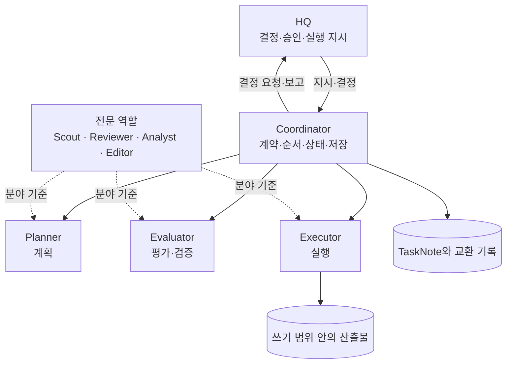
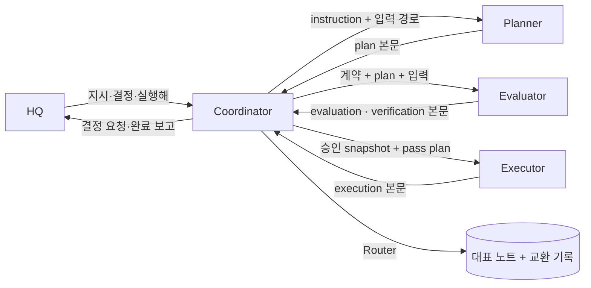

# 조직-구조

## overview

회사를 구성하는 주체와 책임을 설명합니다. [HQ](Operating_Model_admin.md#hq와-ai의-뜻) 한 명 아래에 AI의 과정 역할과 전문 역할이 있고, 역할마다 산출물과 쓸 수 있는 곳이 정해져 있습니다.

| 섹션 | 내용 | 적용 |
|---|---|---|
| [조직도](#조직도) | HQ, 과정 역할, 전문 역할의 관계 | 운영 매뉴얼 |
| [과정-역할](#과정-역할) | 작업 순서에서 맡는 책임 | 운영 매뉴얼 |
| [전문-역할](#전문-역할) | 분야별 기준을 가진 역할 | 운영 매뉴얼 |
| [책임-매트릭스](#책임-매트릭스) | 활동마다 결정·수행·검토 주체 | 운영 매뉴얼 |
| [역할과-프로세스의-관계](#역할과-프로세스의-관계) | 역할은 프로세스가 아니라 책임 단위 | 운영 매뉴얼 |
| [관련-문서](#관련-문서) | 역할별 상세 문서 | 운영 매뉴얼 |

## 조직도

현재 운영은 HQ와 AI Agent 하나의 두 층입니다. 아래 그림은 확장 모드의 역할 구조입니다. 기본 모드에서는 같은 책임을 작업 Agent 하나가 수행하고, 결과는 새 문맥 subagent가 독립 확인합니다.

## 과정-역할

현재는 AI Agent 하나가 [작업 루프](../AI/Workflow_agent.md#loop-at-a-glance)를 수행하고 독립 확인 단계만 새 문맥 subagent가 맡으며, 필요할 때 [전문 역할](#전문-역할)의 기준을 적용합니다.

### 과정-역할-확장

| 역할 | 한 줄 책임 | 산출 기록 | 쓸 수 있는 곳 | 금지 | 상세 |
|---|---|---|---|---|---|
| Coordinator | [작업 계약](../AI/Roles/Coordinator_agent.md#contract-normalization) 고정, 호출 순서, 상태, 저장, HQ 인계 | instruction, decision-request, decision-response, report | 대표 TaskNote, Router를 통한 [교환 기록](Document_System_admin.md#교환-기록), 잠금, checkpoint | 계획·평가 내용 작성, HQ 결정 대리 | [Coordinator](../AI/Roles/Coordinator_agent.md) |
| Planner | 완료 기준을 만족하는 실행 가능한 계획 | plan | [스테이징](Workspace_and_Tools_admin.md#런타임과-router) 파일 | 실행, 완료 기준·범위·[위험도](Risk_and_Authority_admin.md#위험도) 변경 | [Planner](../AI/Roles/Planner_agent.md) |
| Evaluator | 계획 평가와 실행 결과 검증 | evaluation, verification | 스테이징 파일 | 계획·산출물 수정, 통과 기준 완화 | [Evaluator](../AI/Roles/Evaluator_agent.md) |
| Executor | 통과·승인된 계획의 실행과 증거 수집 | execution과 실제 산출물 | 잠긴 [쓰기 범위](../HQ/Control_Settings_admin.md#쓰기-범위), 스테이징 | 계획 밖 행동, 평가 수정, 원본 덮어쓰기 | [Executor](../AI/Roles/Executor_agent.md) |

기록 종류의 정의는 [문서 종류](../AI/Task_and_Record_Schema_agent.md#document-kinds)에 있고, 역할이 일하는 순서는 [작업 흐름](../AI/Workflow_agent.md#loop-at-a-glance)에 있습니다.

## 전문-역할

전문 역할은 제품이나 모델 이름이 아니라 책임으로 정의합니다. 작업마다 기본값을 좁힐 수는 있지만 NDA나 안전 규칙을 약하게 만들 수는 없습니다.

| 역할 | 기본 입력 | 기대 산출 | 금지 |
|---|---|---|---|
| Research Scout | 연구 질문, 출처 조건 | 인용이 달린 근거 요약 | 출처를 지어내거나 숨김 |
| Design Reviewer | spec, 설계 노트, 체크리스트 | 위험 순으로 정렬한 발견 | 범위 없이 설계 DB 수정 |
| Data Analyst | 데이터 색인, 분석 요구 | 재현 가능한 분석 보고 | 원 데이터 변경 |
| Publication Editor | 주장, 근거, 투고처 조건 | 수정안과 남은 공백 | 근거 없는 주장 과장 |

과정 역할과 결합하는 방법은 [전문 역할 문서](../AI/Roles/Specialist_Roles_agent.md#pairing-with-process-roles)에 있습니다.

## 책임-매트릭스

**결** = 결정, **수** = 수행, **검** = 검토, **통** = 결과를 받아 봄.

| 활동 | HQ | Coordinator | Planner | Evaluator | Executor |
|---|---|---|---|---|---|
| 목표·완료 기준 설정 | 결 | 수 (정규화) | — | — | — |
| 작업 접수와 계약 고정 | 통 | 수 | — | — | — |
| 계획 작성 | — | 통 | 수 | — | — |
| 계획 평가 | — | 통 | 통 | 수 | — |
| 위험도 2 승인과 실행 지시 | 결 | 수 (요청) | — | — | — |
| 실행 | — | 통 | — | — | 수 |
| 결과 검증 | — | 통 | — | 수 | 통 |
| 정본 반영 (STATUS 본문, Decisions) | 통 | 통 (대상·권한 확인) | — | 검 | 수 (승인된 쓰기 범위) |
| HQ 결정 요청 | 결 | 수 | 검 (선택지 초안) | 검 (근거) | — |
| 종료 | 검 (검토가 있을 때) | 수 | — | — | — |

누가 어떤 판단을 HQ에게 올려야 하는지는 [판단 권한 경계](Risk_and_Authority_admin.md#판단-권한-경계)에 있습니다.

## 역할과-프로세스의-관계

| 원칙 | 내용 |
|---|---|
| 역할은 책임 단위 | [기본 모드](../Setup/README.md#도입-모드)에서는 작업 Agent 하나가 순서대로 수행하고 확인은 새 문맥 subagent. 확장 모드는 Coordinator 세션이 각 역할을 호출 |
| 평가 독립성 | 평가·확인은 작성 문맥과 분리된 새 호출로 받음. 기본 모드는 [독립 확인](../AI/Workflow_agent.md#independent-check), 확장 모드는 Evaluator. 불가능하면 그 사실을 기록하고 HQ 검토로 넘김 ([호출 규칙](../AI/Roles/Coordinator_agent.md#invocation-rules)) |
| 쓰기 경계 | HQ는 지시·결정을 편집할 수 있고, Agent 중에서는 Coordinator만 TaskNote를 씀. 다른 역할은 본문을 스테이징으로 돌려줌 ([런타임과 Router](Workspace_and_Tools_admin.md#런타임과-router)) |
| 전달 경로 | 역할끼리 직접 주고받지 않고 모두 Coordinator를 거침 |

## 관련-문서

- [운영 모델](Operating_Model_admin.md) — 이 구조가 나온 원칙
- [명령과 보고 체계](Command_and_Report_Flow_admin.md) — 역할 사이에 지시와 보고가 오가는 경로
- [AI 안내](../AI/README.md) — 역할별 조항 문서 목록
- [HQ의 역할](../HQ/HQ_Role_admin.md) — 조직도 맨 위의 책임
