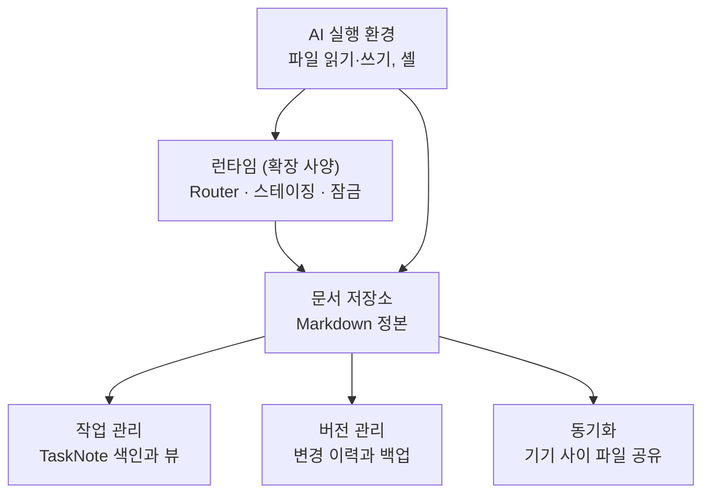

# 작업-공간과-도구

## overview

회사가 돌아가는 작업 공간을 도구 이름이 아닌 기능 계층으로 설명합니다. 이 회사가 실제로 쓰는 도구와 설정 값은 [도구 설정](AGENT_NODE_GOVERNANCE/Architecture/Company_Profile_admin.md#도구-설정)에 있어서, 도구를 바꿔도 이 문서의 규칙은 그대로 씁니다.

| 섹션 | 내용 | 적용 |
|---|---|---|
| [작업-공간-계층](#작업-공간-계층) | 계층 다섯 개와 각 계층의 일 | 운영 매뉴얼 |
| [문서-저장소](#문서-저장소) | 정본 파일과 영역 폴더 | 운영 매뉴얼 |
| [작업-관리](#작업-관리) | TaskNote 색인과 뷰 | 운영 매뉴얼 |
| [버전-관리와-백업](#버전-관리와-백업) | 브랜치, 권한, 백업 방식 | 운영 매뉴얼 |
| [동기화](#동기화) | 여러 기기와 동기화 제외 대상 | 운영 매뉴얼 |
| [런타임과-router](#런타임과-router) | Router, 스테이징, 잠금, checkpoint | 운영 매뉴얼 |
| [도구-요구-조건](#도구-요구-조건) | 계층마다 필요한 기능과 대안 | 운영 매뉴얼 |
| [관련-문서](#관련-문서) | 도구 값과 규칙 | 운영 매뉴얼 |

## 작업-공간-계층

| 계층 | 맡는 일 | 이 회사의 도구 |
|---|---|---|
| 문서 저장소 | 정본 문서와 작업 문서를 파일로 보관 | [도구 설정](AGENT_NODE_GOVERNANCE/Architecture/Company_Profile_admin.md#도구-설정) |
| 작업 관리 | TaskNote를 색인하고 상태별로 보여 줌 | 같은 곳 |
| 버전 관리 | 변경을 diff로 보고 되돌림 | 같은 곳 |
| 동기화 | 여러 기기에서 같은 파일을 씀 | 같은 곳 |
| 런타임 (확장 사양) | 파일 생성 규칙 검사, 잠금, 임시 본문 | [`{runtime-dir}`](AGENT_NODE_GOVERNANCE/Architecture/Company_Profile_admin.md#작업-공간-경로) |
| AI 실행 환경 | Agent가 파일을 읽고 쓰고 명령을 실행 | [AI 실행 환경](AGENT_NODE_GOVERNANCE/Architecture/Company_Profile_admin.md#사람과-역할-배정) |

## 문서-저장소

- **정본은 Markdown:** 상태와 결정은 Markdown 문서가 소유합니다. 시각화 파일은 연결과 흐름만 보여 줍니다 ([정본 문서](Document_System_admin.md#정본-문서)).

- **영역 폴더는 질문 하나에 답함:** "다음에 무엇을 할까", "무엇을 만드나", "재사용 절차는", "왜 동작하나", "아직 위치가 없는가", "끝났는가"처럼 폴더마다 질문이 하나입니다. 실제 영역은 [영역과 정본](AGENT_NODE_GOVERNANCE/Architecture/Company_Profile_admin.md#영역과-정본)에 있습니다.

- **승격하되 복제하지 않음:** 프로젝트에서 나온 지식은 두 번째 프로젝트가 필요로 할 때 Wiki로 옮기고, 원본을 복제하지 않습니다.

- **대용량 미디어는 밖으로:** 동영상은 작업 공간 밖 [`{assets-folder}`](AGENT_NODE_GOVERNANCE/Architecture/Company_Profile_admin.md#작업-공간-경로)에 같은 경로 구조로 둡니다.

## 작업-관리

작업 관리 도구는 TaskNote의 태그와 frontmatter를 읽어 목록·달력·표로 보여 줍니다. TaskNote 파일이 정본이고, 뷰는 그 파일을 읽을 뿐입니다.

| 필요한 뷰 | 선택 조건 | 쓰는 사람 |
|---|---|---|
| 결정 대기 | `hq_todo`가 `decide`, `dispatch`, `review` | HQ |
| 진행 중인 AI 작업 | AI 작업 중 종료 전인 것 | HQ, AI |
| 전체 기록 | 종료된 작업 포함 | 필요할 때 |

HQ는 필요할 때 현황을 보고, 매일 확인하는 대시보드는 두지 않습니다 ([운영 주기](../HQ/HQ_Role_admin.md#운영-주기)).

### hq-행동-뷰-확장

검토 대기는 `in-progress`라서 `done`을 숨기는 기본 뷰에도 남습니다. 결정·실행 지시·검토를 한곳에서 보도록, 태그가 AI 작업이고 `hq_todo`가 `none`이 아닌 작업을 모두 보여 주는 HQ 행동 뷰와, [교환 기록](Document_System_admin.md#교환-기록) 전용 뷰를 추가합니다.

## 버전-관리와-백업

| 규칙 | 내용 |
|---|---|
| 저장소 범위 | 작업 공간 전체를 버전 관리. 버전 관리 데이터는 동기화 폴더 밖에 둠 |
| 작업 브랜치 | AI는 [`{ai-branch}`](AGENT_NODE_GOVERNANCE/Architecture/Company_Profile_admin.md#버전-관리-설정)에서 작업하고, [`{main-branch}`](AGENT_NODE_GOVERNANCE/Architecture/Company_Profile_admin.md#버전-관리-설정) merge는 HQ만 함 |
| 상태 변경 권한 | commit, push, pull request는 위험도 2이며 TaskNote에서 명시적으로 승인된 경우에만 ([위험도](Risk_and_Authority_admin.md#위험도)) |
| 백업 | 추적되는 텍스트는 commit이 백업. 추적 제외 파일은 수정 전에 zip 백업. 바이너리는 동기화로만 보관되므로 덮어쓰지 않고 휴지통으로 옮김 |
| 중첩 저장소 | 작업 공간 안의 저장소는 submodule로 관리 ([중첩 저장소](../AI/Common_Rules_agent.md#nested-repositories)) |

실제 명령과 순서는 [버전 관리](../AI/Common_Rules_agent.md#version-control)와 [백업](../AI/Common_Rules_agent.md#backup)에 있습니다.

## 동기화

- **동기화 제외:** 작업 공간의 버전 관리 데이터와 가상환경(`.venv`)은 동기화하지 않습니다. 기존 중첩 저장소가 `.git`을 안에 보관하는 예외는 [회사 프로필](AGENT_NODE_GOVERNANCE/Architecture/Company_Profile_admin.md#버전-관리-설정)에 따르며, 위치를 바꾸려면 별도 이전 계획을 씁니다.

- **한 저장소, 한 기기:** 같은 저장소에서 두 기기가 동시에 버전 관리 명령을 실행하지 않습니다.

- **알려진 사고:** 동기화 환경에서 병합 충돌 표시가 여러 파일에 한꺼번에 기록된 사례가 있습니다 ([알려진 문제](AGENT_NODE_GOVERNANCE/Architecture/Company_Profile_admin.md#알려진-문제)).

### 실행-기기-제한-확장

동기화 파일을 분산 잠금으로 믿지 않습니다. 시범 운영 기간에는 지정한 기기 한 대에서 Coordinator 하나만 실행합니다.

## 런타임과-router

| 구성 | 위치 | 버전 관리 | 역할 |
|---|---|---|---|
| Router | [`{router}`](AGENT_NODE_GOVERNANCE/Architecture/Company_Profile_admin.md#작업-공간-경로) | 추적 | TaskNote와 교환 기록 파일을 만들고 규칙을 검사 ([Router의 역할](../AI/Routing_agent.md#router-role)) |
| 스테이징 | [`{runtime-dir}`](AGENT_NODE_GOVERNANCE/Architecture/Company_Profile_admin.md#작업-공간-경로)의 `staging/` | 제외, 동기화 밖 | 역할이 돌려준 본문을 저장 전에 보관 |
| 잠금 | 같은 폴더의 `locks/` | 제외, 동기화 밖 | 같은 작업·경로를 두 세션이 동시에 쓰지 못하게 함 ([잠금과 예산](../AI/Roles/Coordinator_agent.md#locks-and-budget)) |
| checkpoint | [`{checkpoint-dir}`](AGENT_NODE_GOVERNANCE/Architecture/Company_Profile_admin.md#작업-공간-경로) | 추적 | 중단·대기 후 재개 정보 ([checkpoint와 재개](../AI/Roles/Coordinator_agent.md#checkpoint-and-resume)) |

잠금과 쓰는 중인 본문을 동기화 밖에 두는 이유는, 잠금이 다른 기기로 복사되면 의미가 없어지고 쓰는 중인 파일이 충돌 사본을 만들기 때문입니다.

## 도구-요구-조건

| 계층 | 필요한 기능 | 없으면 생기는 문제 | 대안 |
|---|---|---|---|
| 문서 저장소 | Markdown, 상대 경로 링크, 제목 앵커, Mermaid | 링크와 다이어그램이 깨짐 | 코드 저장소 웹 화면만으로도 읽을 수 있음 |
| 작업 관리 | 태그 색인, frontmatter 필터 뷰 | HQ가 결정 대기 작업을 찾기 어려움 | Router `check` 출력이나 수동 표 |
| 버전 관리 | 브랜치, diff, 되돌리기, 중첩 저장소 | 위험도 0–1 자율 실행의 안전장치가 없음 | zip 백업 + 모든 수정을 위험도 2로 운영 |
| 동기화 | 선택 사항 | 기기 한 대에서만 작업 | — |
| AI 실행 환경 | 파일 읽기·쓰기, 셸, 새 문맥 호출 | 새 문맥 subagent의 독립 확인과 역할 분리 평가가 불가능 | 기본 모드는 `독립 확인 불성립`을 기록하고 결과를 HQ 검토로 넘김 ([독립 확인](../AI/Workflow_agent.md#independent-check)). 확장 모드는 [CO-206](../AI/Roles/Coordinator_agent.md#invocation-rules) |
| 스크립트 런타임 | 확장 모드 Router 실행 | 확장 모드 기록 검사를 할 수 없음 | [기본 모드](../Setup/README.md#도입-모드)로 운영, Router를 사용한 것으로 표시하지 않음 |

## 관련-문서

- [회사 프로필](AGENT_NODE_GOVERNANCE/Architecture/Company_Profile_admin.md) — 계층마다 실제로 쓰는 도구와 경로
- [공통 규칙](../AI/Common_Rules_agent.md) — 파일, 백업, 버전 관리 절차
- [라우팅](../AI/Routing_agent.md) — Router의 상세 동작
- [다른 기업에 도입하기](../HQ/Protocol_Governance_admin.md#다른-기업에-도입하기) — 도구를 바꿔 적용하는 절차
