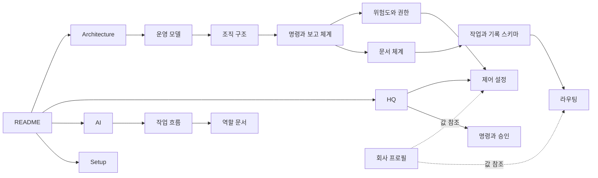

# jm-protocol

## overview

JM_Protocol은 사람 한 명과 AI Agent가 함께 운영하는 1인 연구 기업의 구조와 규칙을 정의합니다. 처음 배우는 사람, 운영자인 HQ, 일을 맡는 AI Agent, 이 구조를 다른 기업에 가져가려는 사람이 모두 이 문서에서 출발합니다.

| 섹션 | 내용 | 상태 | 근거 |
|---|---|---|---|
| [이-프로토콜은-무엇인가](#이-프로토콜은-무엇인가) | 목적, 세 폴더의 역할, 정본 여부 | proposed | 체크리스트 C1 |
| [독자별-읽는-순서](#독자별-읽는-순서) | 독자마다 먼저 읽을 문서 | proposed | 체크리스트 C1 |
| [문서-지도](#문서-지도) | 전체 문서와 한 줄 설명 | proposed | 체크리스트 C1 |
| [상태-표시](#상태-표시) | adopted·proposed와 인스턴스 값 표기 | proposed | 체크리스트 C1 |
| [도입과-구조-개선](#도입과-구조-개선) | 개선 내용과 시작 경로 | proposed | 체크리스트 C1–C10 |
| [버전과-변경-이력](#버전과-변경-이력) | 현재 버전과 변경 기록 | proposed | 체크리스트 C1 |
| [관련-문서](#관련-문서) | 다음에 열 문서 | — | — |
| [관리자-검토-체크리스트](#관리자-검토-체크리스트) | 운영 채택 전 HQ 검토 항목 | proposed | 이번 구조 검토 요청 |

> [!NOTE]
> 제안 — v0.2.0 검토용 초안입니다. 저장소 배포는 승인되었지만 운영 채택과 JouleMatter 전체 재구조화는 아직 승인되지 않았습니다. 정본 교체 전까지 현재 운영 규칙의 원본은 [근거 자료](Architecture/Company_Profile.md#근거-자료)의 기존 규약입니다. 검토 항목은 이 README의 마지막 섹션 한 곳에서 관리합니다.

## 이-프로토콜은-무엇인가

JouleMatter는 연구 방향과 결정을 한 사람이 맡고, 조사·계획·실행·검증·기록을 AI Agent가 맡는 조직입니다. 사람의 주의력이 가장 부족한 자원이라는 전제에서 [운영 원칙](Architecture/Operating_Model.md#운영-원칙)을 세웠습니다.

| 폴더 | 답하는 질문 | 주 독자 |
|---|---|---|
| [Architecture](Architecture/README.md) | 회사는 어떻게 생겼고, 명령과 보고는 어떻게 오가나 | 모든 독자 |
| [HQ](HQ/README.md) | 사람은 무엇을 하고 무엇을 조절할 수 있나 | HQ, 도입하려는 기업 |
| [AI](AI/README.md) | Agent는 어떤 역할로 나뉘고 어떤 순서로 일하나 | AI Agent, 기여자 |
| [Setup](Setup/README.md) | 새 회사에 어떻게 설치하고 기존 회사는 어떻게 이전하나 | HQ, 도입 담당 |

규칙은 일반형으로 적고 이 회사의 이름·경로·도구 값은 [회사 프로필](Architecture/Company_Profile.md#회사-정보)에 둡니다. 다른 기업은 [초기 템플릿](Setup/Templates.md)으로 로컬 프로필과 채택 기록을 만들고, 필요한 도구와 권한을 검증한 뒤 사용합니다.

## 독자별-읽는-순서

| 독자 | 목적 | 읽는 순서 |
|---|---|---|
| 처음 배우는 사람 | 회사 구조 이해 | [운영 모델](Architecture/Operating_Model.md) → [조직 구조](Architecture/Organization.md) → [명령과 보고 체계](Architecture/Command_and_Report_Flow.md) → 모르는 말은 [용어집](Architecture/Glossary.md) |
| HQ | 지시·결정·검토 | [HQ 안내](HQ/README.md) → [HQ의 역할](HQ/HQ_Role.md) → [제어 설정](HQ/Control_Settings.md) → [명령과 승인](HQ/Commands_and_Approval.md) → [검토와 종료](HQ/Review_and_Closure.md) |
| AI Agent | 작업 수행 | [AI 안내](AI/README.md) → [공통 규칙](AI/Common_Rules.md) → [작업 흐름](AI/Workflow.md) → 맡은 역할 문서 → [작업과 기록 스키마](AI/Task_and_Record_Schema.md) |
| 도입하려는 기업 | 자기 회사에 적용 | [적합성](Architecture/Operating_Model.md#이-모델이-맞지-않는-경우) → [설치 안내](Setup/README.md) → [템플릿](Setup/Templates.md) → [채택 기록](Setup/Adoption.md) |
| 기여자 | 문서 개선 | [문서 작성 규칙](HQ/Protocol_Governance.md#문서-작성-규칙) → [기여 방법](HQ/Protocol_Governance.md#기여-방법) |

## 문서-지도

### architecture-문서

| 문서 | 한 줄 설명 |
|---|---|
| [운영 모델](Architecture/Operating_Model.md) | 왜 1인 기업 모델인가, 운영 원칙 |
| [조직 구조](Architecture/Organization.md) | HQ와 AI 역할, 책임 매트릭스 |
| [명령과 보고 체계](Architecture/Command_and_Report_Flow.md) | 지시·결정·실행·보고의 전달 경로와 작업 상태 |
| [문서 체계](Architecture/Document_System.md) | 정본 문서, TaskNote, 교환 기록 |
| [위험도와 권한](Architecture/Risk_and_Authority.md) | 위험도, 실행 모드, 검토 깊이, 판단 경계 |
| [작업 공간과 도구](Architecture/Workspace_and_Tools.md) | 문서 저장소·작업 관리·버전 관리·동기화·런타임 |
| [작업 공간 구조](Architecture/Workspace_Layout.md) | 최소 폴더와 프로젝트 수명, 자료 배치 기준 |
| [회사 프로필](Architecture/Company_Profile.md) | 이 회사의 인스턴스 값 |
| [용어집](Architecture/Glossary.md) | 용어와 정의 위치 |

### hq-문서

| 문서 | 한 줄 설명 |
|---|---|
| [HQ의 역할](HQ/HQ_Role.md) | HQ의 책임, 위임하지 않는 판단, 운영 주기 |
| [제어 설정](HQ/Control_Settings.md) | 작업마다 조절하는 값과 기본값 |
| [명령과 승인](HQ/Commands_and_Approval.md) | 채팅 명령, 결정표, 승인과 실행 지시 |
| [검토와 종료](HQ/Review_and_Closure.md) | 현황 보기, 결과 검토, 종료 |
| [프로토콜 관리](HQ/Protocol_Governance.md) | 변경, 정본 교체, 작성 규칙, 기여, 도입 |

### ai-문서

| 문서 | 한 줄 설명 |
|---|---|
| [공통 규칙](AI/Common_Rules.md) | 모든 Agent가 지키는 규칙 |
| [작업 흐름](AI/Workflow.md) | 역할의 순서와 흐름도 |
| [작업과 기록 스키마](AI/Task_and_Record_Schema.md) | 문서 종류, 필드, 불변식 |
| [라우팅](AI/Routing.md) | Router의 배치·판정·처리 순서 |
| [기록 형식](AI/Reporting_Style.md) | 작업 기록과 결정표 형식 |
| [Coordinator](AI/Roles/Coordinator.md) | 접수, 호출, 상태, HQ 인계 |
| [Planner](AI/Roles/Planner.md) | 계획서 작성과 수정 |
| [Evaluator](AI/Roles/Evaluator.md) | 계획 평가와 결과 검증 |
| [Executor](AI/Roles/Executor.md) | 실행과 증거 수집 |
| [전문 역할](AI/Roles/Specialist_Roles.md) | Scout, Reviewer, Analyst, Editor |

### setup-문서

| 문서 | 한 줄 설명 |
|---|---|
| [설치와 도입](Setup/README.md) | 기본·확장 모드, 새 회사 시작, 저장소 운영 |
| [초기 템플릿](Setup/Templates.md) | 회사 프로필·진입 파일·CONTEXT·TaskNote·STATUS·Decisions |
| [채택과 버전 고정](Setup/Adoption.md) | 회사별 승인·활성화·업데이트 기록 |
| [이전 절차](Setup/Migration.md) | 기존 파일 대응표·파일럿·검증·복구 |

## 상태-표시

| 표기 | 뜻 | 예 |
|---|---|---|
| `adopted` | 출처 회사가 과거 채택한 규칙. 이번 셋업 전체 또는 새 회사의 승인을 뜻하지 않음 | 근거 열에 `DEC-HQ-005` |
| `proposed` | HQ 승인 전인 제안 | 근거 열에 `제안서 04 Q1` 또는 `체크리스트 C1` |
| `> [!NOTE]` 제안 | proposed 섹션 첫 줄의 안내 | "제안 — 04 Q1 결정 대기" |
| `{이름}` | 회사마다 다른 인스턴스 값 | [`{hq-owner}`](Architecture/Company_Profile.md#사람과-역할-배정) |
| `CO-101` 같은 번호 | 역할 조항 번호 | [Coordinator의 접수 조항](AI/Roles/Coordinator.md#접수) |

표기 규칙의 전체 내용은 [상태 표시 규칙](HQ/Protocol_Governance.md#상태-표시-규칙)에 있습니다.

## 도입과-구조-개선

| 검토에서 찾은 문제 | v0.2.0 개선 |
|---|---|
| 단일 회사의 값과 새 회사의 승인이 섞일 가능성 | 공통 프로토콜·로컬 프로필·회사 채택 기록 분리 |
| 작은 작업도 Router·다중 호출을 요구 | 기본 모드와 확장 모드 구분. 경량 작업은 TaskNote만 사용 |
| 승인 전 계획 작성 금지로 승인받을 계획을 만들 수 없음 | 계획은 작성·평가 가능, 실제 실행은 별도 권한 gate |
| autonomous에도 승인 버전 일치를 요구 | 실행 모드별 권한 확인, 미승인 값과 보고 patch 분리 |
| 불변 기록과 일괄 스키마 변환의 충돌 | run별 스키마 고정, 과거 기록 원문 보존 |
| 중복 기록·실패 receipt·잠금·부모 편집의 모호함 | request-id, 성공 receipt 확인, 실제 경로·잠금 재검사, 두 파일의 부분 성공 처리 |
| 실제 이전과 재사용 방법 부족 | 초기 템플릿, 파일별 대응표, 파일럿, 복구·활성화 기준 |

현재 제공되는 것은 프로토콜 문서·템플릿·[정적 검사기](tools/validate.py)입니다. Router와 자동 운영 서비스는 설계 상태이며, 확장 모드를 선택하면 구현·시험이 추가로 필요합니다.

## 버전과-변경-이력

| 버전 | 날짜 | 변경 | 상태 |
|---|---|---|---|
| 0.2.0 | 2026-09-15 | 전체 구조 검토, 권한·기록 모순 보완, Setup·템플릿·이전 절차·검사기·관리자 체크리스트 추가 | 초안, 운영 채택 대기 |
| 0.1.0 | 2026-09-15 | 기존 AI 운영 규약과 제안서 01–06을 한 체계로 통합한 첫 초안 | 초안, HQ 검토 대기 |

버전을 올리는 기준은 [변경 절차](HQ/Protocol_Governance.md#변경-절차)를 따릅니다.

## 관련-문서

- [Architecture 안내](Architecture/README.md) — 회사 구조부터 읽을 때
- [HQ 안내](HQ/README.md) — 운영자 매뉴얼
- [AI 안내](AI/README.md) — Agent 매뉴얼
- [용어집](Architecture/Glossary.md) — 모르는 용어를 찾을 때
- [설치와 도입](Setup/README.md) — 새 회사에 적용할 때

## 관리자-검토-체크리스트

**검토 대상: v0.2.0. 아직 승인되지 않은 항목은 모두 빈 체크박스로 남겼습니다.** Obsidian에서 체크할 수 있는 Markdown 목록이며 GitHub에서도 같은 파일·섹션으로 이동합니다. 기존 문서의 C1–C10은 이 목록을 가리킵니다.

- [ ] **C1 구조·재사용 범위** — [작업 공간 구조](Architecture/Workspace_Layout.md#최소-구조), [설치와 도입](Setup/README.md#새-기업-시작), [문서 작성 규칙](HQ/Protocol_Governance.md#문서-작성-규칙)을 검토합니다. Architecture·HQ·AI·Setup 구성, 로컬 프로필 분리, 상대 링크와 제목 규칙을 채택할지 확인합니다.

- [ ] **C2 권한·승인 경계** — [위험도와 실행 모드](Architecture/Risk_and_Authority.md#위험도), [승인과 실행 지시](HQ/Commands_and_Approval.md#승인과-실행-지시), [실행 전 검사](AI/Roles/Executor.md#실행-전-검사)를 검토합니다. 명시 실행 요청의 효력, 조건부 승인, autonomous의 권한 근거를 확인합니다.

- [ ] **C3 역할과 도입 모드** — [기본·확장 모드](Setup/README.md#도입-모드), [책임 매트릭스](Architecture/Organization.md#책임-매트릭스), [호출 규칙](AI/Roles/Coordinator.md#호출-규칙)을 검토합니다. AI 권장: 기본 모드로 시작하고, 확장 모드는 구현·파일럿 통과 뒤 활성화합니다.

- [ ] **C4 스키마·기록 보존** — [task 필드](AI/Task_and_Record_Schema.md#대표-task-필드-변경-제안), [불변식](AI/Task_and_Record_Schema.md#불변식), [스키마 변경](AI/Task_and_Record_Schema.md#스키마-변경)을 검토합니다. task_id, blockedBy 전환, run별 스키마 고정, 과거 불변 기록 보존을 확인합니다.

- [ ] **C5 Router와 작업 뷰** — [처리 순서](AI/Routing.md#처리-순서), [실패와 동시성](AI/Routing.md#실패와-동시성), [HQ 행동 뷰](Architecture/Workspace_and_Tools.md#hq-행동-뷰-제안)를 검토합니다. 구현 범위, 중복·부분 실패·경로 검증, 템플릿 제외와 done 상태의 검토 대기 표시를 확정합니다.

- [ ] **C6 평가 기준·예산·증거** — [통과 조건](AI/Roles/Evaluator.md#통과-조건), [예산](HQ/Control_Settings.md#예산과-반복-한도), [연구 증거 추적](AI/Roles/Evaluator.md#연구-증거-추적)을 검토합니다. AI 권장 B: 모든 항목 4/5·필수 gate·blocking 0을 통과 기준으로 하고 총점은 기록만 합니다. A를 원하면 총점 85 하한도 추가합니다. 선택과 예외를 채택 기록에 적습니다.

- [ ] **C7 상태·중단·재개** — [작업 상태](Architecture/Command_and_Report_Flow.md#작업-상태), [checkpoint](AI/Roles/Coordinator.md#checkpoint와-재개), [receipt](AI/Roles/Executor.md#receipt와-재시도)를 검토합니다. 상태 6개, 단일 실행 기기, 성공 단계만 생략, 실행 중 job의 자원 예약을 확인합니다.

- [ ] **C8 이전 전 환경·복구** — [알려진 문제](Architecture/Company_Profile.md#알려진-문제), [선행 조건](Setup/Migration.md#선행-조건), [백업](AI/Common_Rules.md#백업)을 검토합니다. 기존 충돌 복구와 tracked·untracked·ignored 자료 백업, 실제 복원 시험을 이전의 선행 조건으로 확정합니다.

- [ ] **C9 전체 재구조화 범위** — [이전 대응표](Setup/Migration.md#이전-대응표), [실행과 복구](Setup/Migration.md#실행과-복구), [정본 교체](HQ/Protocol_Governance.md#정본-교체-절차)를 검토합니다. 기존 최상위 영역 유지, 진입 파일·규약·CONTEXT·템플릿 갱신, 실제 파일별 이동표를 바탕으로 실행 범위를 승인합니다.

- [ ] **C10 채택·배포 정책** — [승인 기록](Setup/Adoption.md#승인-기록), [저장소 운영](Setup/README.md#저장소-운영), [완료 기준](Setup/Migration.md#완료-기준)을 검토합니다. 적용 commit·로컬 프로필·모드·예외·공개 범위·제3자 라이선스를 확정하고, 기존 운영 결정을 대체하는 실제 DEC를 기록합니다. 이미 요청한 GitHub push와 운영 활성화는 별개입니다.

전체 검토 후 [승인 기록](Setup/Adoption.md#승인-기록)에 검토 commit과 선택을 남깁니다. 실제 재구조화는 파일별 대응표·백업·파일럿 결과까지 준비한 뒤 그 범위에 대한 실행 지시로 시작합니다. 이 체크리스트를 완료했다고 파일 이동이나 운영 규약 교체가 자동 실행되지는 않습니다.
